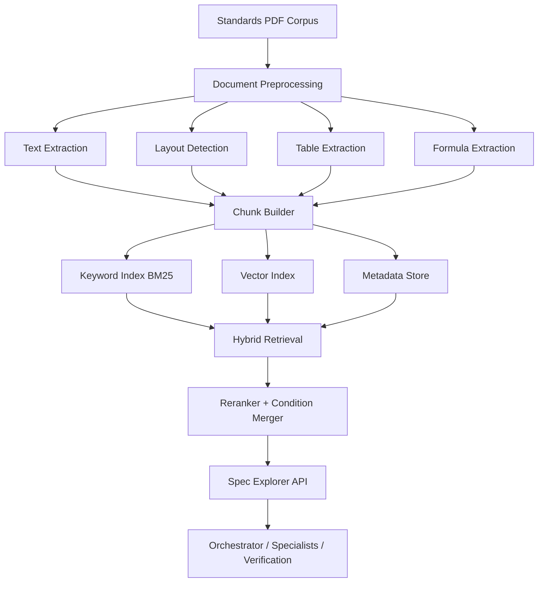

# Table-Aware RAG Specification

Status: Draft  
Version: v0.1  
Last Updated: 2026-02-26

## Context Summary
- This specification defines a table-aware RAG architecture for engineering standards (ASME/API/IEEE/AISC/ACI).
- The design prioritizes numerical extraction fidelity, conditional applicability, and citation traceability.
- It is a design blueprint for implementation teams, not production code.

## Architecture Overview
- Ingestion pipeline: PDF parsing -> layout and table extraction -> normalized chunks.
- Retrieval pipeline: hybrid (keyword + vector + metadata filter) with reranking.
- Serving interface: Spec Explorer API for section lookup and table value extraction.
- Governance: version-pinned standard corpus with citation integrity checks.

## Detailed Specifications

### 1) End-to-End Architecture Diagram


### 2) Document Preprocessing Pipeline

#### 2.1 Input and Normalization
- Inputs:
  - standards PDFs and revisions
  - document metadata (code, year, edition)
- Normalization:
  - canonical file naming
  - checksum and version registration

#### 2.2 Structural Extraction
- Text extraction with page anchors.
- Layout segmentation into section/title/body/table blocks.
- Table extraction preserving row/column semantics.
- Formula extraction with variable context.

#### 2.3 Chunking Strategy
Chunk types:
- Table chunk: full table + caption + nearby condition paragraphs.
- Section chunk: paragraph-level normative statements.
- Formula chunk: equation + variable definitions + applicability notes.

Chunk metadata must include:
- `standard`
- `version`
- `section_or_table`
- `page_number`
- `content_type`
- `applicable_conditions`
- `cross_references`

### 3) Index and Retrieval Strategy

#### 3.1 Index Partitioning
- `piping_index`
- `rotating_index`
- `electrical_instrumentation_index`
- `steel_civil_index`
- `cross_reference_index`

#### 3.2 Hybrid Retrieval
- Stage 1: keyword recall (BM25).
- Stage 2: semantic retrieval (embedding vector).
- Stage 3: metadata filtering by material, temperature, pressure, service.
- Stage 4: rank fusion and reranking.

#### 3.3 Retrieval Pseudocode
```python
def hybrid_search(query, discipline=None, filters=None):
    keyword_hits = bm25_search(query, top_k=50, discipline=discipline)
    vector_hits = vector_search(query, top_k=30, discipline=discipline)

    merged = reciprocal_rank_fusion(keyword_hits, vector_hits)

    if filters:
        merged = apply_metadata_filters(merged, filters)

    reranked = rerank_with_condition_alignment(merged, query, filters)
    return reranked[:10]
```

### 4) Condition-Aware Value Extraction
- Table lookup must return both value and applicability constraints.
- If interpolation is needed, API returns:
  - required interpolation method
  - governing section reference
  - uncertainty note

Output contract example:
```json
{
  "value": 19100,
  "unit": "psi",
  "source": {
    "standard": "ASME B31.3",
    "section_or_table": "Table A-1",
    "page": 123,
    "version": "2020"
  },
  "conditions": [
    "service applicability note",
    "temperature applicability note"
  ],
  "interpolation": {
    "required": false,
    "method": null,
    "reference": null
  }
}
```

### 5) Spec Explorer API Contract

#### 5.1 `search_standard`
- Input:
  - `query`
  - `discipline`
  - `filters`
- Output:
  - ranked chunks with citations and conditions

#### 5.2 `extract_table_value`
- Input:
  - `standard`
  - `table`
  - `lookup_conditions`
- Output:
  - exact value (or interpolation instruction)
  - citation bundle
  - applicability constraints

#### 5.3 `resolve_cross_reference`
- Input:
  - citation anchor
- Output:
  - linked clause list with versions

### 6) Caching and Performance Optimization
- Cache tiers:
  - query-result cache (short TTL)
  - table lookup cache (medium TTL)
  - versioned citation cache (long TTL)
- Warm-up strategy:
  - preload frequently used tables and sections by discipline.
- Concurrency strategy:
  - async retrieval fan-out and bounded rerank workers.

### 7) Data Quality and Validation
- Table extraction QA:
  - header integrity checks
  - row count sanity checks
  - numeric parse validity checks
- Citation QA:
  - page/section anchor presence
  - edition/version consistency

### 8) Failure Modes and Fallback
- If table parse confidence is low:
  - return `verification_required` status
  - include top source image/page anchors for human review
- If no high-confidence match:
  - return structured `not_found` with query refinement suggestions

### 9) Integration Constraints
- All agent calls and responses must follow shared message schema:
  - `docs/specs/shared/MESSAGE_SCHEMA_AND_RED_FLAG_TAXONOMY_V0.1.md`
- Red flags from retrieval layer:
  - `STD.INVALID_REFERENCE`
  - `STD.OUT_OF_SCOPE_APPLICATION`
  - `FMT.SCHEMA_VALIDATION_FAILED`

## Verification Strategy
- Offline benchmark:
  - table extraction precision/recall on annotated samples
  - citation accuracy checks
- Retrieval benchmark:
  - Recall@10, Precision@5, MRR
- Runtime integrity:
  - random audit of retrieved citation bundles
  - consistency checks against verification layer

## Performance and Accuracy Targets
- Table extraction accuracy: >=95%
- Formula extraction quality: >=90%
- Retrieval Recall@10: >=85%
- Retrieval Precision@5: >=90%
- p95 retrieval latency (single query): <2s

## Next Steps
1. Finalize document ingestion schema and index mappings.
2. Create evaluation dataset for table and citation accuracy.
3. Implement Spec Explorer API stubs and contract tests.
