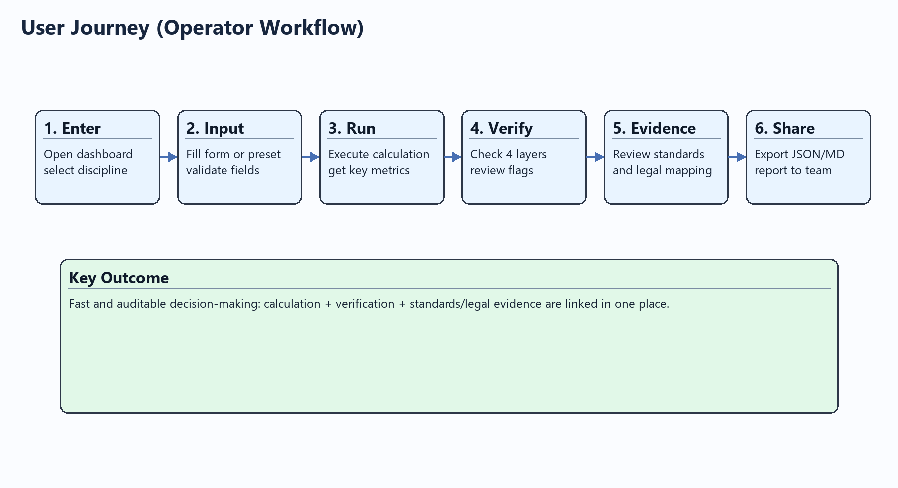
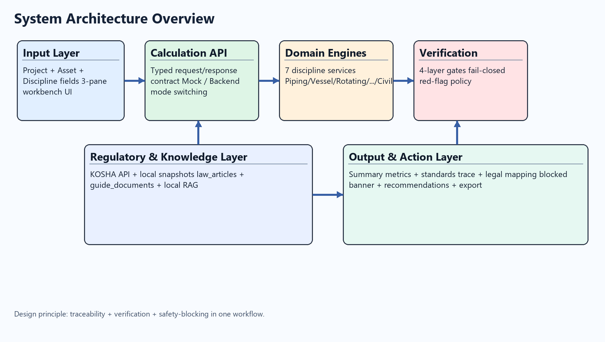
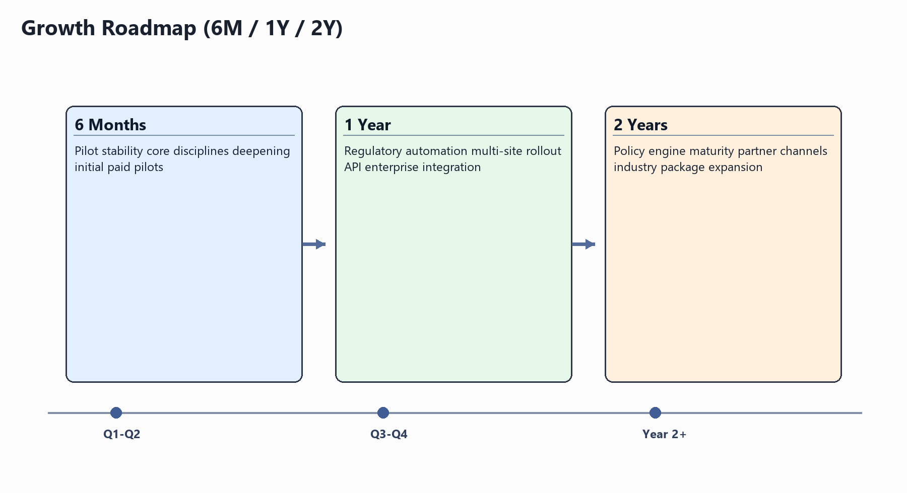
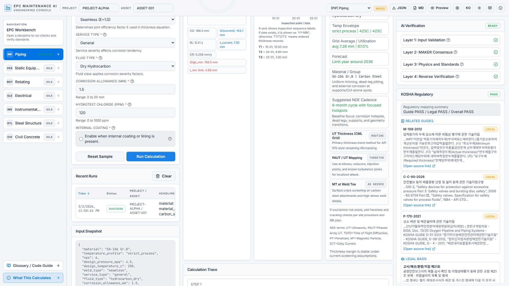
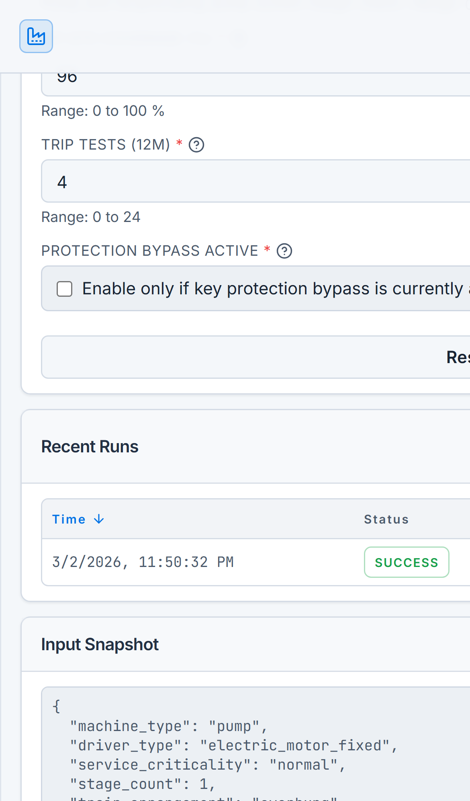

# EPC Maintenance AI Workbench 프로젝트 소개서 (v0.1)

문서 버전: v0.1  
작성일: 2026-03-02  
문서 목적: 투자자, 잠재 고객, 개발팀이 동일한 기준으로 제품 가치와 실행 가능성을 평가할 수 있도록 사업/기술/운영 관점을 통합 정리

## 0. 프로젝트 기본 정보

| 항목 | 내용 |
| --- | --- |
| 프로젝트명 | EPC Maintenance AI Workbench |
| 서비스 분류 | B2B SaaS 웹 애플리케이션 + 규제/기술 데이터 서비스 |
| 핵심 문제 | 설비 건전성 평가가 공종별로 분절되어 있고, 계산 결과의 기준 근거(표준/법령)와 검증 로그가 단일 화면에서 연결되지 않아 의사결정 속도와 감사 대응력이 떨어지는 문제 |
| 타겟 사용자 | 유지보수 엔지니어, 신뢰성 엔지니어, 검사 리드, 기술 관리자 |
| 주요 기능 | 7개 공종 계산, 4계층 검증, 표준/법령 트레이서빌리티, 3-패널 워크벤치, 로컬 RAG 기반 규제 질의 |
| 기술 스택 | Next.js 14 + TypeScript, Python API, Zustand, Recharts, Zod, SQLite 기반 로컬 RAG |
| 현재 상태 | v0.1 MVP 구현 완료 및 프론트엔드 릴리스 체크리스트 통과(2026-02-27) |
| 차별화 요소 | 계산-검증-근거를 한 화면에서 연결, KOSHA API + 로컬 스냅샷 이중화, 안전 우선 차단(FAIL-CLOSED) 정책 |

## 0.1 문서 근거 및 산정 기준

| 근거 ID | 근거 내용 | 출처 파일 |
| --- | --- | --- |
| E1 | 제품 포지셔닝(B2B SaaS, 3-패널, 주요 사용자) | `docs/specs/frontend/00_OVERVIEW_AND_ARCHITECTURE_V0.1.md` |
| E2 | 7개 공종 범위와 계산 항목 | `frontend/README.md`, `frontend/app/calculation-guide/page.tsx` |
| E3 | 검증 체계(4계층, 게이트/차단 정책) | `docs/specs/VERIFICATION_FRAMEWORK_SPEC_V0.1.md` |
| E4 | 런타임 검증 성능(220 케이스, 정확도 1.0000) | `outputs/verification_report_runtime.md` |
| E5 | 프론트엔드 릴리스 상태(완료/검증일) | `docs/plans/FRONTEND_EXECUTION_PLAN_V0.1.md`, `docs/plans/FRONTEND_RELEASE_CHECKLIST_V0.1.md` |
| E6 | 규제 데이터 커버리지(법령/지침 문서 수) | `datasets/kosha/manifest.json`, `datasets/kosha_guide/manifest.json` |
| E7 | 아키텍처 토폴로지(오케스트레이터 + 도메인/지원 에이전트) | `docs/architecture_overview.md` |

---

# 1. Executive Summary

## 1.1 문제 정의

산업 설비 운영 조직은 배관, 정기기, 회전기기, 전기, 계장, 철골, 토목 등 공종별로 서로 다른 계산 방식과 판단 기준을 사용한다. 이때 실제 운영에서 발생하는 문제는 세 가지다.

1. 동일 자산을 여러 공종이 동시에 평가해야 하지만, 결과가 개별 엑셀/보고서로 흩어져 통합 판단이 늦어진다.  
2. 계산 수치의 근거(어느 표준 조항을 적용했는지)와 검증 로그가 분리되어 감사 대응 비용이 커진다.  
3. 안전 관련 경고를 “참고” 수준으로 처리하는 시스템에서는 차단되어야 할 상태가 통과될 수 있다.

본 프로젝트는 위 문제를 “속도”보다 “신뢰 가능한 의사결정” 중심으로 해결하도록 설계되었다. 제품 구조 자체가 3-패널(입력/결과/검증)로 고정되어 있고, 4계층 검증 게이트를 통과하지 못하면 결과 배포를 차단하는 안전 우선 정책을 채택한다(E1, E3).

## 1.2 솔루션 개요

EPC Maintenance AI Workbench는 7개 공종의 계산과 검증을 하나의 작업 화면에서 제공하는 B2B SaaS형 엔지니어링 워크벤치다(E1, E2). 주요 작동 방식은 다음과 같다.

1. 사용자 입력: 공종별 필드와 프리셋으로 현장 조건 입력  
2. 계산 실행: 공종별 모델에서 핵심 지표 산출  
3. 검증 수행: 4계층 검증(형식, 합의, 물리/표준, 역검증) 동시 적용  
4. 근거 제시: 계산 단계별 표준 참조와 경고/차단 이유 표시  
5. 조치 권고: 유지, 모니터링 강화, 즉시 개입 등 실행형 권고 제공

또한 규제 데이터는 외부 API 의존만 두지 않고 로컬 스냅샷을 병행해, 포털 장애 시에도 최소한의 법령/지침 매핑을 유지하도록 설계되었다(E6).

## 1.3 핵심 가치 제안

| 가치 제안 | 사용자 이익 | 측정 지표(예시) | 근거 |
| --- | --- | --- | --- |
| 의사결정 속도 단축 | 공종별 자료 수집/대조 시간 감소 | 자산 1건 분석 리드타임 | 3-패널 통합 UX(E1), 계산 가이드(E2) |
| 감사 대응력 강화 | 계산값-표준-검증 로그가 같은 결과물에 존재 | 감사 질의 1건당 소명 준비시간 | 표준 참조/검증 패널 상시 노출(E1, E3) |
| 안전 리스크 관리 | 위험 상태를 경고가 아닌 차단 상태로 처리 | 차단 상태 누락률, 레드플래그 처리 SLA | fail-closed 정책(E3), UI blocked 배너(E2) |

추가로, 현재 런타임 검증 보고서 기준 220/220 통과, 정확도 1.0000이 기록되어 초기 모델 검증 신뢰도를 확보했다(E4). 해당 수치는 운영 확정 KPI가 아니라 v0.1 기준 내부 검증 결과로 해석해야 한다.

## 1.4 시장 기회: 예상 시장 규모 및 성장 가능성

### 1.4.1 시장 기회의 구조

본 서비스는 단순 계산 앱이 아니라 “규제 근거가 필요한 설비 무결성 의사결정”을 지원하는 툴이다. 따라서 시장 정의는 다음 3개 축으로 구성한다.

1. 고위험 설비 운영 조직(정유/석유화학/발전/중공업/플랜트 EPC)  
2. 다공종 협업이 필수인 조직(검사+운전+신뢰성+EHS)  
3. 내부 감사 또는 대외 규제 대응 문서화를 요구받는 조직

### 1.4.2 TAM/SAM/SOM 시나리오(가정 기반)

아래 산정은 “가격 정책이 아직 확정되지 않은 v0.1 단계”를 반영해 시나리오 기반으로 작성했다. 수치 자체보다 산정식의 투명성을 우선한다.

산정식:
`연간 기회 규모 = 대상 사이트 수 x 사이트당 연간 계약단가`

| 구분 | 대상 사이트 수 가정 | 사이트당 연간 계약단가 가정 | 연간 기회 규모(원) | 가정 근거 |
| --- | --- | --- | --- | --- |
| 보수 시나리오 | 50 | 24,000,000 | 1,200,000,000 | 단일 사업장, 제한 기능(계산+기본 보고) |
| 기준 시나리오 | 120 | 42,000,000 | 5,040,000,000 | 7공종 + 검증 + 규제 매핑 + 감사 패키지 |
| 확장 시나리오 | 250 | 60,000,000 | 15,000,000,000 | 멀티사이트 운영 + API 연동 + SLA 계약 |

주의:
- 위 수치는 외부 시장조사 수치가 아니라 제품 범위(E1~E3)와 엔터프라이즈 소프트웨어 과금 구조를 반영한 내부 가정이다.  
- 실제 계약 전환율/객단가 확보 후 3개월 주기로 재산정이 필요하다.

### 1.4.3 성장 가능성 드라이버

1. 규제/감사 대응 자동화 수요 증가: 법령-지침-표준 연계 출력 요구가 강화되는 환경에서 문서화 자동화 가치가 크다(E6).  
2. 공종 통합 운영 요구 확대: 단일 공종 최적화보다 “설비 단위 통합 위험 판단”이 운영 KPI에 직접 연결된다(E7).  
3. 데이터 자산 축적 효과: 케이스 실행 로그와 검증 결과가 누적될수록 모델 교정과 추천 정밀도가 개선된다(E4).

---

# 2. 서비스 상세

## 2.1 주요 기능 설명

| 기능 | 설명 | 사용자 시나리오 | 기대 효과 | 근거 |
| --- | --- | --- | --- | --- |
| 7공종 계산 엔진 | 공종별 입력 계약과 계산 로직으로 핵심 지표 산출 | 유지보수 엔지니어가 자산별 입력 후 계산 실행 | 공종별 수기 계산 일관성 확보 | E2 |
| 4계층 검증 | 형식/합의/물리-표준/역검증 게이트 | 기술관리자가 결과 승인 전 검증 상태 확인 | 승인 기준 명확화, 위험 상태 차단 | E3 |
| 표준 참조 추적 | 계산 단계에 적용된 표준 참조를 결과에 연결 | 감사/검토 회의에서 근거 조항 즉시 확인 | 추적성 강화, 설명 가능성 향상 | E1, E3 |
| 규제 매핑 패널 | KOSHA 지침 및 법령 근거를 함께 제시 | EHS 담당자가 법령 충족 여부 점검 | 규제 검토 리드타임 단축 | E6 |
| 실행 히스토리/내보내기 | JSON/Markdown 내보내기와 실행 기록 유지 | 프로젝트 단위 주간 보고서 작성 | 보고 자동화, 재현성 확보 | E2, E5 |

### 기능 시나리오 A: 배관 잔여수명 검토

1. `/piping`에서 설계압력/온도, 재질, 두께 이력을 입력한다.  
2. 시스템이 `t_min_mm`, 부식률, 잔여수명, 검사주기를 산출한다.  
3. 검증 패널에서 차단/경고 여부를 확인한다.  
4. 결과를 Markdown으로 내보내고 검사팀 회의 자료로 사용한다.

### 기능 시나리오 B: 회전기기 위험 조기 탐지

1. `/rotating`에서 기기타입, 구동타입, 진동·보호 데이터 입력  
2. 보정 진동한계, 기계/공정/보호 인덱스, 서지/NPSH 위험 확인  
3. API 670 커버리지와 트립시험 이력을 동시에 검토  
4. 모니터링 주기 강화 또는 즉시 점검으로 의사결정

### 기능 시나리오 C: 통합 대시보드 기반 우선순위 관리

1. 홈 대시보드에서 공종별 최근 실행 상태/알림/준수 지표 확인  
2. 경고가 많은 공종부터 워크벤치 진입  
3. 우선 순위 이슈를 주간 계획으로 반영

## 2.2 사용자 여정

| 단계 | 사용자 행동 | 시스템 반응 | 산출물 |
| --- | --- | --- | --- |
| 1. 진입 | 대시보드 또는 공종 페이지 진입 | 최근 실행/알림/상태 표시 | 우선순위 대상 공종 선정 |
| 2. 입력 | 폼 입력 또는 프리셋 선택 | 유효성 검증, 입력 스냅샷 저장 | 재현 가능한 실행 조건 |
| 3. 계산 | Run Calculation 실행 | 공종 계산 및 결과 생성 | 핵심 지표/권고안 |
| 4. 검증 | 4계층 패널/레드플래그 확인 | 차단/경고 상태 표시 | 승인/보류 판단 |
| 5. 근거 확인 | 표준/법령 패널 조회 | 근거 조항 및 요약 표시 | 감사 대응 근거 |
| 6. 공유 | JSON/Markdown 내보내기 | 파일 생성 | 보고/회의 자료 |

## 2.3 화면 구성

| 화면 | 경로 | 역할 | 핵심 요소 |
| --- | --- | --- | --- |
| 메인 대시보드 | `/` | 전사/프로젝트 관점 운영 상태 확인 | 공종 네비게이터, 실행 요약, 검증/규제 카드 |
| 공종 워크벤치 | `/piping` 등 7개 라우트 | 실무 계산과 검증 수행 | 3-패널, 입력폼, 결과카드, 검증/표준/규제 |
| 계산 가이드 | `/calculation-guide` | 계산 범위와 해석 기준 안내 | 공종별 입력/출력/결정 포인트 요약 |
| 용어집 | `/glossary` | 표준/용어 정의 확인 | 검색, 공종 필터, 핀/내보내기 |

### 3-패널 구조 설명

1. 좌측 패널: 입력 폼, 실행 히스토리, 입력 스냅샷  
2. 중앙 패널: 계산 요약, 시각화, 계산 트레이스, 권고안  
3. 우측 패널: 검증 레이어, 규제 준수, 표준 참조, 플래그

## 2.4 대표 사용 사례

### 사례 1: 정기점검 주기 최적화

문제:
배관 및 정기기 점검 주기가 경험치 기반으로 운영되어 과점검/과소점검이 반복됨

적용:
배관/정기기 워크벤치로 잔여수명과 검사주기를 동시에 계산하고, 레드플래그 기준으로 우선순위 재조정

효과:
현장 점검 리소스를 위험도 중심으로 재배치 가능

### 사례 2: 턴어라운드(Shutdown) 사전 리스크 정리

문제:
여러 공종 이슈가 분절 보고되어 일정 충돌과 누락이 발생

적용:
대시보드에서 공종별 경고/차단 건을 수집하고, 동일 자산의 교차 리스크를 묶어 정비 항목 정의

효과:
정비범위 확정 회의에서 근거 기반 의사결정 가능

### 사례 3: 규제 감사 대응 패키지 생성

문제:
감사 시 계산 근거와 법령 근거를 별도 문서로 수집해야 하므로 대응 시간이 길어짐

적용:
표준 참조 패널 + 규제 매핑 패널 + Markdown 내보내기로 증빙 묶음 생성

효과:
감사 질의 대응의 일관성과 속도 개선

---

# 3. 기술적 우수성

## 3.1 기술 아키텍처

시스템은 “입력-계산-검증-근거-출력” 파이프라인을 기준으로 분리되어 있다.

| 계층 | 구성 | 책임 |
| --- | --- | --- |
| 프론트엔드 | Next.js 워크벤치, 3-패널 UI | 입력 수집, 결과 시각화, 검증/근거 표시 |
| API 계층 | `/api/calculate/{discipline}` | 공종별 계산 요청 라우팅 |
| 도메인 계산 | 7개 공종 서비스 모듈 | 공종별 지표 산출 |
| 검증 계층 | 4-레이어 검증 엔진 | 안전/일관성/역검증 체크 |
| 규제/지식 계층 | KOSHA API + 로컬 스냅샷 + 로컬 RAG | 법령/지침 매핑과 검색 |

## 3.2 기술 선택 근거

| 선택 기술 | 선택 이유 | 사업/운영 관점 이점 |
| --- | --- | --- |
| Next.js 14 + TypeScript | 라우팅/SSR/개발 생태계 안정성과 정적 타입 기반 계약 관리 | 제품 확장 시 화면 추가와 API 계약 관리가 용이 |
| Zustand | 경량 상태 관리로 워크벤치 단일 상태 모델 유지 | 실행 이력/설정 상태를 단순하게 유지 |
| Zod + 폼 검증 | 입력 계약의 명시적 검증 | 잘못된 입력으로 인한 계산 오류 선제 차단 |
| Recharts | 엔지니어링 지표 시각화 구현 속도 | 결과 해석 시간 단축 |
| Python 계산 서비스 | 수식/도메인 로직 구현 유연성 | 공종별 모델 고도화 및 검증 자동화에 유리 |
| 로컬 RAG(SQLite) | 외부 포털 장애 시 검색 연속성 확보 | 규제 근거 조회의 가용성 향상 |

## 3.3 확장성 및 안정성

### 확장성 설계

1. 공종 모듈 분리: 7개 공종이 독립 모듈로 운영되어 신규 공종 확장 시 영향 범위를 제한  
2. 계약 중심 인터페이스: 입력/출력 스키마가 명시되어 백엔드/프론트 동시 변경 리스크 감소  
3. 모드 분리: mock 모드와 backend 모드를 분리해 개발/운영 전환을 단순화

### 안정성 설계

1. 안전 차단 정책: critical red flag 또는 standards mismatch 시 결과 차단(E3)  
2. 품질 게이트: lint/typecheck/unit/e2e/build를 릴리스 기준으로 운영(E5)  
3. 이중 데이터 소스: 규제 데이터 API 실패 시 로컬 스냅샷 fallback(E6)

### 현재 검증 수준

| 항목 | 결과 | 근거 |
| --- | --- | --- |
| 런타임 검증 케이스 | 220/220 통과 | E4 |
| 전체 정확도 | 1.0000 | E4 |
| 프론트 릴리스 상태 | v0.1 체크리스트 통과 | E5 |

## 3.4 보안 및 데이터 보호

| 정책 영역 | 적용 정책 | 비고 |
| --- | --- | --- |
| 비밀정보 관리 | 클라이언트 번들에 시크릿 미포함, 서버 측 환경변수 경계 유지 | E1, E5 |
| 입력/출력 검증 | 타입 강제 및 스키마 검증 | 파싱 오류/타입 오염 방지 |
| 로깅 정책 | 클라이언트 텔레메트리에 민감 원문 미기록 | 규제/고객 정보 노출 최소화 |
| 장애 대응 | Sev1(차단 상태 표시 오류) 즉시 롤백/핫픽스 | E1 운영 스펙 |
| 감사 추적 | 계산 단계/표준 참조/플래그 이력 유지 | E3 트레이서빌리티 요건 |

보안상 민감한 구현 세부(내부 토큰 관리, 인프라 정책 상세)는 본 제안서에 포함하지 않았다.

---

# 4. 비즈니스 모델

## 4.1 수익 구조

v0.1 기준 권장 과금 모델은 “사이트 기반 구독 + 옵션 모듈 + 온보딩 서비스” 구조다.

| 수익 항목 | 과금 단위 | 포함 범위 |
| --- | --- | --- |
| 기본 구독 | 사이트/연 | 7공종 계산, 검증 패널, 기본 리포트 |
| 규제/지식 옵션 | 사이트/연 | KOSHA 확장 매핑, 로컬 RAG 고급 기능 |
| 엔터프라이즈 연동 옵션 | 프로젝트 | API 연계, SSO, 전사 데이터 인터페이스 |
| 도입 서비스 | 1회 | 초기 데이터 매핑, 사용자 교육, 운영 룰셋 설정 |

권장 원칙:
1. 시작은 단순한 사이트 기반 과금으로 진입장벽을 낮춘다.  
2. 규제/감사 기능은 옵션으로 두되, 안전 요구가 높은 산업군에는 번들화한다.  
3. 대형 고객에는 API/운영 SLA를 별도 계약으로 분리한다.

## 4.2 경쟁 분석

본 비교는 특정 회사 비방이 아니라 고객 관점의 “대안 유형 비교”다.

| 비교 항목 | 수기 엑셀/보고서 | 일반 CMMS/설비관리 | 단일 공종 계산 도구 | EPC Maintenance AI Workbench |
| --- | --- | --- | --- | --- |
| 7공종 통합 | 낮음 | 보통 | 낮음 | 높음 |
| 계산 근거 추적 | 낮음 | 낮음 | 보통 | 높음 |
| 4계층 검증 | 없음 | 낮음 | 낮음~보통 | 높음 |
| 규제(법령/지침) 연결 | 낮음 | 낮음 | 낮음 | 높음 |
| 감사 대응 문서화 | 낮음 | 보통 | 보통 | 높음 |
| 초기 도입 난이도 | 낮음 | 보통 | 보통 | 보통 |

## 4.3 시장 진입 전략

### 단계 1: 파일럿 확보(0~6개월)

1. 대상: 규제 대응 필요성이 높은 2~3개 사업장  
2. 범위: 배관+회전+정기기 우선(현장 빈도 높은 공종 중심)  
3. 산출물: 월간 리스크 리포트, 감사 대응 샘플 패키지

### 단계 2: 레퍼런스 전개(6~12개월)

1. 파일럿 성과를 “운영 KPI 개선 사례”로 정리  
2. 동일 산업군 확장(멀티사이트 제안)  
3. 엔터프라이즈 연동(백엔드 API, 내부 시스템 연결)

### 단계 3: 플랫폼화(12~24개월)

1. 고객별 룰셋/검증 정책 템플릿화  
2. 산업군별 패키지(정유형/발전형/제조형)  
3. 파트너 채널(검사기관/엔지니어링사) 확대

## 4.4 성장 로드맵 (6개월 / 1년 / 2년)

| 시점 | 제품 목표 | 영업 목표 | 운영 목표 |
| --- | --- | --- | --- |
| 6개월 | 파일럿 버전 안정화, 핵심 공종 고도화 | 초기 유료 파일럿 확보 | 고객 피드백 루프 정착 |
| 1년 | 규제 매핑/리포팅 자동화 강화 | 멀티사이트 계약 전환 시작 | 운영 SLA/지원 체계 표준화 |
| 2년 | 정책 엔진/권고 자동화 고도화 | 산업군 확장 및 파트너 채널 | 고객별 운영 거버넌스 통합 |

---

# 5. 확장 가능성

## 5.1 추가 기능 개발 계획

1. 시나리오 비교 분석: 동일 자산의 “현재 vs 개선안” 영향 비교  
2. 예측 유지보수 결합: 실행 이력 기반 위험 추세 예측  
3. 관리자 워크플로우: 승인 프로세스, 차단 해제 권한 로그

## 5.2 신규 시장/고객군 진출 가능성

1. 국내 대형 플랜트 운영사(정유/석유화학/발전)  
2. 다사업장 제조 그룹의 중앙 기술조직  
3. 유지보수/검사 전문 서비스 기업(서비스형 제공 모델)

## 5.3 기술적 발전 방향

1. 데이터 계층: 로컬 스냅샷 + 외부 API 동기화 자동화 고도화  
2. 검증 계층: 케이스 확장 및 공종별 경계조건 검증 강화  
3. 설명 계층: 결과 설명 자동생성(리포트 문장화, 감사 템플릿)

## 5.4 장기 비전

장기적으로 본 서비스의 목표는 “계산 도구”를 넘어, 설비 무결성 의사결정의 표준 운영 레이어가 되는 것이다. 핵심은 다음 세 가지다.

1. 의사결정 표준화: 공종별 해석 편차를 줄이고 승인 기준을 명확화  
2. 감사 대응 내재화: 사후 문서 수집이 아닌 실행 시점 근거 생성  
3. 안전 우선 운영: 경고 표시를 넘어 차단 기반 운영 규율 정착

---

# PART 2. 스크린샷 제작 가이드 (필수 6장)

## 6. 촬영 공통 원칙

| 항목 | 권장 기준 |
| --- | --- |
| 해상도 | 데스크톱 1920x1080, 모바일 390x844(세로) |
| 브라우저 | Chrome 최신 버전, 100% 줌 |
| 데이터 | 프리셋 + 샘플 프로젝트(`PROJECT-ALPHA`)로 재현 가능하게 구성 |
| 언어 | 투자/고객 제안용은 한국어 UI 우선, 필요 시 영문 병행 |
| 파일명 | `01_landing.png` ~ `06_outcome.png` 순서 고정 |
| 저장 위치 | `docs/proposals/assets/project-intro/screenshots/` |

## 6.1 스크린샷 #1 메인 화면/랜딩페이지

목적:
서비스의 첫인상과 핵심 가치(다공종 통합 + 검증 중심)를 전달

필수 포함 요소:
서비스명(EPC Maintenance AI), 핵심 메시지(대시보드 서브타이틀), 주요 CTA 버튼(예: Open Piping Workbench, Calculation Guide)

촬영 팁:
대시보드 상단 카드와 상태 배지가 한 화면에 보이도록 100% 줌을 유지하고, 불필요한 브라우저 북마크 바는 숨김

문서 삽입 위치:
섹션 2.3 화면 구성

실행 경로:
`/` 또는 `/ko`

## 6.2 스크린샷 #2 핵심 기능 화면

목적:
핵심 기능(입력 -> 계산 -> 결과)의 실제 사용 모습을 보여줌

필수 포함 요소:
입력 폼, 실행 버튼, 결과 카드(요약 지표), 계산 트레이스

촬영 팁:
`/piping`에서 프리셋(예: Legacy Steam) 적용 후 실행하여 실데이터에 가까운 결과값을 표시

문서 삽입 위치:
섹션 2.1 주요 기능 설명

실행 경로:
`/piping` 또는 `/ko/piping`

## 6.3 스크린샷 #3 대시보드/관리 화면

목적:
운영 상태 관리와 통계 기반 의사결정 기능을 어필

필수 포함 요소:
공종 상태 카드, 알림 수치, 최근 실행, 준수율/평균응답 지표

촬영 팁:
실행 이력이 3건 이상 보이도록 사전 계산 후 촬영하고, 배지 색상(정상/경고/차단)이 함께 보이게 구성

문서 삽입 위치:
섹션 2.2 사용자 여정

실행 경로:
`/`

## 6.4 스크린샷 #4 설정/환경설정 화면

목적:
운영 모드/연동 설정/개인화(언어·테마) 기능의 실무 활용성을 보여줌

필수 포함 요소:
API Mode(mock/backend), Backend API Prefix, Theme, Language 전환

촬영 팁:
Top Bar의 Settings 패널을 펼친 상태로 촬영하고, backend 모드 선택 상태를 명확히 표시

문서 삽입 위치:
섹션 3.4 보안 및 데이터 보호

실행 경로:
임의의 워크벤치 페이지에서 상단 Settings 버튼 클릭

## 6.5 스크린샷 #5 모바일/반응형 화면

목적:
모바일에서도 핵심 기능 접근이 가능함을 증명

필수 포함 요소:
모바일 레이아웃, 공종 선택 드롭다운, 터치 가능한 주요 버튼

촬영 팁:
DevTools 디바이스 모드(iPhone 12/390x844)에서 `/rotating` 화면을 세로/가로 1장씩 촬영 후 세로본을 본문에 사용

문서 삽입 위치:
섹션 3.1 기술 아키텍처

실행 경로:
`/rotating` 또는 `/ko/rotating`

## 6.6 스크린샷 #6 결과/성과 화면

목적:
서비스 사용 결과로 어떤 의사결정 인사이트를 얻는지 제시

필수 포함 요소:
성과 지표(예: integrity index, remaining life), 플래그/권고, 표준/법령 근거 패널

촬영 팁:
경고 또는 차단이 1건 이상 포함된 결과를 사용하면 “문제 탐지 -> 조치 권고” 흐름이 더 분명해짐

문서 삽입 위치:
섹션 1.3 핵심 가치 제안

실행 경로:
`/rotating` 또는 `/vessel` 실행 결과 화면

---

## 7. 스크린샷 제작 체크리스트

1. 각 이미지가 목적 섹션과 정확히 매칭되는지 확인  
2. 한 화면에 핵심 텍스트와 핵심 지표가 동시에 보이는지 확인  
3. 테스트/더미 데이터임을 오해하지 않도록 프로젝트/자산 식별자를 통일  
4. 민감 정보(실제 설비 ID, 내부 URL, API 키)가 노출되지 않았는지 확인  
5. 최종 문서 삽입 후 캡션 번호와 본문 참조 번호를 일치시킴

---

## 8. 부록: 핵심 수치 근거 요약

| 수치/주장 | 값 | 근거 |
| --- | --- | --- |
| 제품 유형 | B2B SaaS 웹앱 | E1 |
| 공종 범위 | 7개 공종 | E1, E2 |
| 검증 구조 | 4계층 게이트 | E3 |
| 런타임 검증 케이스 | 220 | E4 |
| 런타임 정확도 | 1.0000 | E4 |
| 프론트 릴리스 검증일 | 2026-02-27 | E5 |
| KOSHA 코퍼스 총 행수 | 18,576 | E6 |
| KOSHA 지침 문서 수 | 1,327 | E6 |
| KOSHA 법령 아티클 수 | 3,102 | E6 |
| KOSHA 가이드 API 항목 수 | 1,039 | E6 |
