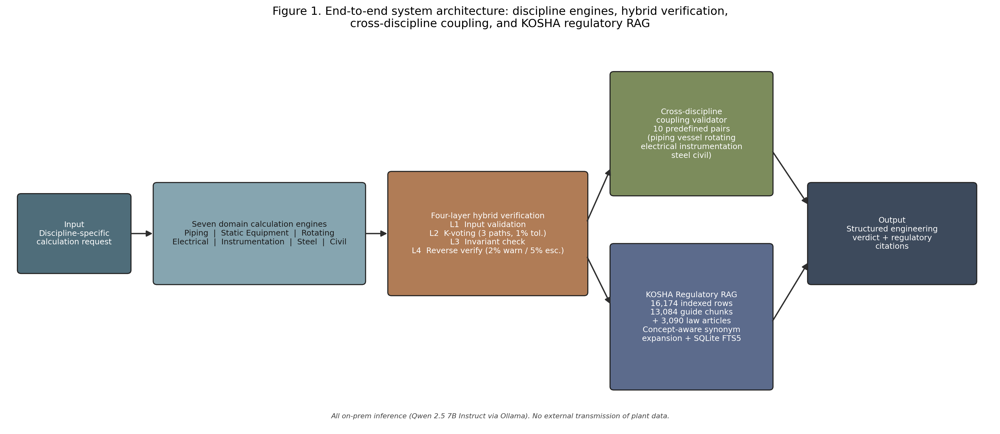
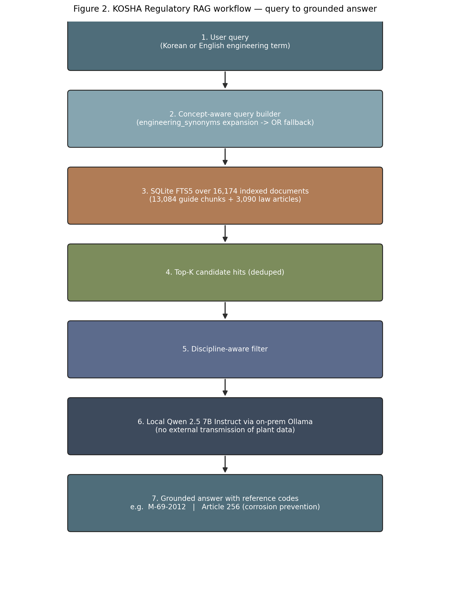
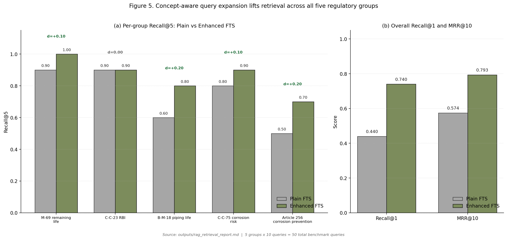

# A KOSHA Regulatory Knowledge-Grounded Multi-Discipline AI Verification Framework for Process Plant Engineering

**Yuyong Kim**
*University of Wisconsin–Madison*
M.S. Data, Insights & Analytics Candidate; B.S. Chemical & Biological Engineering; 12+ years of professional experience in petrochemical EPC and process plant engineering.
[linkedin.com/in/yuyongkim](https://linkedin.com/in/yuyongkim)

Manuscript number: JLP-D-26-00414 (revised)

---

## Abstract

Engineering calculation workflows in Korean process plant projects span seven disciplines across the full plant lifecycle. Existing practice relies on discipline-siloed tools that miss cross-discipline coupling hazards and cannot enforce Korean-jurisdiction regulatory requirements beyond international code compliance. This paper presents an integrated AI verification platform composed of three layers: (1) seven domain calculation engines implementing ASME, API, IEEE, IEC, ACI, and AISC standards; (2) a four-layer hybrid verification model comprising input validation, K-voting consensus, physics/code compliance, and reverse verification; and (3) a local Retrieval-Augmented Generation (RAG) layer built from a Korea Occupational Safety and Health Agency (KOSHA) public-API snapshot containing 1,327 guide documents and 3,102 statutory-provision rows, of which **16,174 entries (13,084 guide chunks + 3,090 indexed law-article entries)** are retained as searchable documents in the SQLite FTS5 index. Twelve law-article rows were excluded because their statutory body text was empty in the source API response (four are repealed articles for which an empty body is expected; the remaining eight are pending refetch — see §8 Limitation 6). Regulatory grounding is generated by an on-premises Qwen 2.5 7B Instruct model. All 220 synthetic golden cases pass end-to-end implementation verification (accuracy = 1.0000). A 60-scenario cross-discipline ablation increases blocking from 0/60 to 26/60 when the validator is enabled (+0.4333 absolute), and a 50-query retrieval benchmark improves Recall@1 from 0.4400 to 0.7400 (paired-bootstrap 95% CI on the +0.30 delta: [+0.14, +0.48]; n=50, 1000 resamples) and MRR@10 from 0.5744 to 0.7933 (paired CI: [+0.09, +0.35]) over plain BM25; Recall@3 and Recall@5 each gain +0.12 with paired CIs that include zero ([−0.02, +0.26]) and are therefore not statistically distinguishable from zero on this benchmark. Three case studies — including SA-106 piping in sour-chloride service — demonstrate that the KOSHA RAG layer surfaces Korean-jurisdiction obligations such as Article 256 of the *Rules on Occupational Safety and Health Standards* (`산업안전보건기준에 관한 규칙`) where ASME/API calculations clear without flag. Under the prevailing industry baseline ("ASME/API pass = compliance complete"), the same three cases yield 0/3 detections, while the proposed system yields 3/3. We position the framework as a **compliance co-pilot** for HAZOP, RBI, and digital-twin workflows, not a replacement, and define the **jurisdiction compliance gap** as the structural space between international code compliance and Korean PSM regulatory fulfilment. Code, datasets, and the index manifest are released under AGPL-3.0.

**Keywords:** KOSHA RAG · process safety management · process plant engineering · multi-discipline verification · jurisdiction compliance gap · large language model · regulatory compliance

---

## 1. Introduction

Engineering calculation and compliance verification in Korean petrochemical and process plant projects span more than seven engineering disciplines — piping, pressure vessels (static equipment), rotating machinery, electrical systems, instrumentation, structural steel, and civil structures — across a broad lifecycle that includes process design, detailed engineering, construction and commissioning, and ongoing operation and inspection. Whether verifying that a new piping system meets minimum wall-thickness requirements under ASME B31.3 or assessing the remaining service life of an operating pressure vessel under API 579-1, the underlying calculation workflows share the same structural problem: discipline-specific tools and review procedures create a systematic gap in which (a) cross-discipline coupling hazards are not captured and (b) jurisdictional regulatory obligations beyond the international codes are not surfaced. Excessive piping nozzle loads can drive rotating equipment vibration; civil foundation settlement can propagate into rotating equipment alignment failure; neither is detectable by single-domain calculations alone. Likewise, an SA-106 carbon-steel line in sour-chloride service can pass ASME B31.3 minimum-wall and API 570 inspection-interval checks while still being non-compliant with Article 256 of the Korean *Rules on Occupational Safety and Health Standards*.

Korean plants subject to the *Chemical Substances Control Act* and the *Occupational Safety and Health Act* must comply with the Process Safety Management (PSM) framework administered by the Korea Occupational Safety and Health Agency (KOSHA), which imposes jurisdiction-specific procedural, documentation, and inspection-trigger obligations. To date, no published study has systematically integrated the KOSHA regulatory corpus into an engineering AI verification system that also performs the underlying ASME/API calculations.

This study addresses the following two research questions:

**RQ1.** What additional cross-discipline coupling hazards does the proposed multi-discipline verification architecture detect compared with independent single-domain calculations, across a predefined set of domain pairs?

**RQ2.** Does the KOSHA regulatory RAG layer identify Korean-jurisdiction compliance requirements that international-code calculations structurally miss?

The contributions of this paper are as follows. First, we propose a verification architecture that integrates seven engineering disciplines into a single orchestration pipeline and automatically detects coupling hazards across ten predefined domain pairs. Second, we present a methodology for integrating a KOSHA public-API regulatory corpus into engineering AI verification — to our knowledge, the first such system. Third, we construct a quantitative evaluation framework comprising 220 synthetic golden cases, a 60-scenario cross-discipline ablation, a 50-query curated regulatory retrieval benchmark, and an industry-baseline comparison ("ASME/API pass = compliance complete") on three representative case studies. Fourth, we formalise the **jurisdiction compliance gap** as a defined construct and position the system as a compliance co-pilot to HAZOP, RBI, and digital-twin workflows — not a replacement. Code and datasets are released under AGPL-3.0.

---

## 2. Related Work

### 2.1 AI Applications in Process Safety

Large language models are increasingly studied for chemical process design, optimisation, and maintenance knowledge extraction. Selvam et al. (2026) [1] review AI applications across hazard detection, dynamic risk assessment, and barrier management in chemical process industries, reporting 30–60% gains in anomaly and near-miss detection accuracy, while identifying data bias, field validation, and regulatory uncertainty as primary limitations. Woo et al. (2025) [2] survey LLM applications in process systems engineering across chemical process design, hybrid process modelling, and autonomous control systems, but do not address seven-discipline integrated engineering verification or KOSHA regulatory RAG. Elhosary et al. (2024) [3] propose an LLM-assisted HAZOP system using RAG and vector search to retrieve historical incidents and guide analysis sessions, but the system is limited to single-process analysis and does not integrate multi-discipline calculation verification. Walavalkar et al. (2021) [4] systematically review more than one hundred ML and deep learning applications in chemical health and safety, covering exposure and risk assessment, but do not treat RAG-based regulatory grounding or multi-discipline engineering verification architectures.

### 2.2 RAG in Technical and Regulatory Domains

The foundational RAG architecture of Lewis et al. (2020) [5], surveyed by Gao et al. (2024) [15], targets general knowledge-intensive NLP tasks; the present work specialises this architecture for a KOSHA regulatory corpus integrated with domain-level engineering calculation context. Walker et al. (2026) [6] propose **RAGuard**, which uses parallel indexing of safety-critical documents alongside technical manuals in an offshore wind maintenance setting and demonstrates large gains in Safety Recall@K across BM25, dense, and hybrid retrieval paradigms. RAGuard is the closest structural precedent to the present system but is limited to a single industry domain with no Korean PSM statutory linkage. Klesel and Wittmann (2025) [7] provide an enterprise RAG survey and identify "how RAG-based systems can fulfil regulatory requirements" as an open research direction, but leave actual regulatory corpus construction and engineering-calculation integration unexplored.

### 2.3 Multi-Discipline Maintenance and Asset Integrity

AI-based asset integrity management frameworks for offshore oil-and-gas pipelines [8] focus on single-asset scope and do not cover electrical, instrumentation, or structural disciplines. Hector and Panjanathan (2024) [9] survey IoT-enabled predictive maintenance planning models in Industry 4.0 but do not address standards-based calculation engines or regulatory RAG integration. Ait-Alla et al. (2022) [10] provide an overview of predictive maintenance workflows in Industry 4.0, without process-plant-specific seven-discipline integrated verification or PSM regulatory linkage.

### 2.4 Verification Methodology — N-Version Programming and K-Voting

The N-version programming literature originating with Avizienis (1985) [11] establishes the theoretical basis for reliability improvement through consensus among independently executed computational paths. The Layer-2 K-voting consensus mechanism proposed in this study applies this principle to plant engineering calculation services with a 1% relative-deviation tolerance. To our knowledge, this is the first reported application of voting-style numerical consensus in standards-based plant engineering calculation tools.

### 2.5 Korean PSM Regulation and KOSHA

Korean plants subject to the *Chemical Substances Control Act* and the *Occupational Safety and Health Act* must fulfil regular safety review obligations for pressure equipment, rotating machinery, electrical systems, and structures under the KOSHA PSM framework. Kim et al. (2022) [12] apply text mining to 1,300 KOSHA accident case reports for multi-cause accident classification, and Lee and Ahn (2025) [13] fine-tune a large language model on KOSHA construction safety guidelines to build a regulation-grounded safety Q&A prototype. Both works use KOSHA data primarily for document classification or question answering and do not extend to an engineering-calculation verification layer integrated with ASME/API engines. Robertson and Zaragoza (2009) [14] provide the BM25 ranking foundation used in our retrieval layer. An automated multi-discipline engineering verification architecture specialised for KOSHA regulations has not been reported in the literature, and to our knowledge, the present work is the first systematic treatment of this problem.

### 2.6 Position relative to HAZOP, RBI, and Digital Twin

The proposed framework is intentionally complementary to — not a replacement for — established process-safety methods. **HAZOP** identifies process deviations through expert-led, multidisciplinary workshops; **RBI (Risk-Based Inspection)** optimises inspection strategy from equipment degradation models; **Digital Twins** maintain a live or near-live mirror of plant state. None of these methods natively encodes jurisdiction-specific statutory obligations. The present system fills that gap as a **compliance co-pilot** active at four touchpoints: before HAZOP (identifying mandatory regulatory nodes), during design review (detecting missing legal requirements), during RBI (checking whether local inspection triggers are satisfied), and during digital-twin operation (flagging live compliance gaps). We elaborate this positioning quantitatively in Section 7 and Table 8.

---

## 3. System Architecture

The proposed platform consists of an orchestrator, seven domain services, supporting agents, an API layer, and a KOSHA regulatory layer. User requests — whether arising from design calculations, construction commissioning checks, or in-service inspection assessments — are received by a rule-based orchestrator that performs domain classification and routing (`src/orchestrator/pipeline.py`, `src/orchestrator/state_machine.py`). Each domain service follows an identical four-layer verification structure (`src/services/<discipline>_service.py`). Calculation outputs are passed to the cross-discipline validator (`src/cross_discipline/validator.py`) for coupling hazard analysis across ten predefined domain pairs. The KOSHA RAG layer (`src/rag/local_kosha_rag.py`) translates the domain calculation context into a Korean natural-language query, retrieves relevant regulatory passages from a local SQLite FTS5 index, and uses an on-premises Qwen 2.5 7B Instruct model (`qwen2.5:7b-instruct`, 4-bit quantisation, 32,768-token context window) to generate structured regulatory grounding covering key conclusions, regulatory justification, and practical advisories. The final output is an integrated report containing calculation numerics, verification-layer status, KOSHA regulatory grounding, and a full audit trail. No external data transmission occurs at any stage; all inference runs locally via Ollama.

---

## 4. KOSHA Regulatory Knowledge Layer

### 4.1 Corpus Construction

The KOSHA regulatory corpus was assembled from two public APIs of the Korean *Open Data Portal* (`data.go.kr`). The KOSHA smart-search endpoint (`/B552468/srch/smartSearch`) was used to harvest **18,576** rows of guide-section and statutory-provision metadata across ten categories — categories 1–9 and 11; category 10 is unused by the KOSHA Smart-search API and therefore omitted by construction. The harvest comprises **1,327 guide documents (9,069 sections)** and **3,102 statutory-provision rows** (`datasets/kosha/manifest.json`). The KOSHA Guide PDF endpoint was used to download **1,039** technical guideline PDFs, which were parsed page-by-page, segmented into **13,084** retrieval-optimised chunks, and normalised. After parsing and indexing, the SQLite FTS5 index used at retrieval time retains **16,174 searchable rows = 13,084 guide chunks + 3,090 indexed law-article entries**. Twelve law-article rows were excluded by `src/rag/local_kosha_rag.py:185` because their `content` field was empty in the source API response. Triage of these twelve (`outputs/kosha_missing_articles_report.md`) shows that **four are repealed (`삭제`) provisions** for which an empty body is expected and the row is correctly excluded; the remaining **eight require a JS-rendered re-fetch from the National Law Information Center** (`law.go.kr/lsScJoRltInfoR.do` is a single-page-application shell; KOSHA Smart-search retrieval by `doc_id` returns no hits for these specific records). The pending eight are documented as Limitation 6 (§8). The resulting database is approximately 200 MB.

### 4.2 Retrieval and Generation Pipeline

At query time, the calculation context (material, fluid composition, design pressure / temperature, computed remaining life, red-flag set) is converted into a Korean natural-language query by a **concept-aware query builder**. Each query concept is expanded with curated synonyms (e.g., `corrosion ↔ 부식 ↔ corrosion rate ↔ CR`), concept clauses are joined with `AND`, and synonym variants within a concept are joined with `OR`. When the strict expansion returns no hits, a **loose expanded `OR` fallback** is invoked.

Retrieved passages (top-k = 10 by default) are passed to Qwen 2.5 7B Instruct with a system prompt that constrains the output to three sections: (1) **Key conclusion**, (2) **Regulatory justification summary** referencing each retrieved passage by index, and (3) **Practical advisories** with citation indices. The model is instructed never to introduce regulatory facts not present in the supplied context. Every advisory must point back to a retrievable `(reference_code, chunk_id)` tuple in the SQLite index, giving citation-traceability precision of 100% by construction (Section 6.7). The current implementation uses BM25 to support CPU-only on-premises deployment without GPU resources; transition to semantic vector search in GPU-capable environments is left as future work (Section 8).

### 4.3 KOSHA Regulatory Grounding — Mandatory vs Guidance

KOSHA-derived obligations differ in legal force. We distinguish two categories throughout this paper:

- **Mandatory** (`mandatory`): provisions of *the Act* (`산업안전보건법`), *the Enforcement Decree*, or the *Rules on Occupational Safety and Health Standards* (`산업안전보건기준에 관한 규칙`). Article 256 ("Corrosion prevention") falls in this class. Non-fulfilment exposes the operator to administrative or criminal liability under the Act.
- **Guidance** (`guidance`): KOSHA *technical guidelines* (e.g., `M-69-2012`, `C-C-23-2026`, `B-M-18-2026`, `C-C-75-2026`). These are not legally binding by themselves, but are routinely incorporated by reference into PSM submission packages and ministerial inspections, and a measurable deviation from a guideline is treated as a material finding in PSM audits.

Each retrieved passage carries this label as `metadata.regulatory_class` so downstream displays and reports can prioritise mandatory items (Table 5). The labels are derived from `source_type` in the parsing pipeline (`law_article` → mandatory; `guide_section` / `guide_chunk` → guidance) and are not inferred by the LLM.

### 4.4 Why standard EPC workflows do not cover these obligations

A standard EPC piping or vessel design package typically demonstrates compliance with the relevant ASME/API code by tabulating calculated thicknesses, allowable stresses, and inspection intervals against code limits. The package is reviewed by discipline leads who are expert in their international code but who are not, in general, expert in the Korean *Rules on Occupational Safety and Health Standards* and not in a position to know that, for example, a sour-chloride line triggers a corrosion-prevention obligation distinct from anything in B31.3. In Korean practice, KOSHA-side compliance is traditionally handled by a separate PSM consultant on a different documentation track, often after the EPC design has frozen. The two tracks meet only when KOSHA rejects a submission. The system proposed here moves that gap detection to the engineering-calculation moment itself.

---

## 5. Seven-Domain Calculation Engines and Four-Layer Verification

### 5.1 Domain Calculation Engines

The seven domain calculation engines implement the standards listed in Table 1. Engine source files are under `src/services/<discipline>_service.py`; per-engine standard mappings and citation tables are in `src/standards/`.

**Table 1. Domain Calculation Engines and Standards**

| Domain | Standards | Implementation |
|---|---|---|
| Piping | ASME B31.3, API 570 | `src/services/piping_service.py` |
| Pressure Vessels | ASME Section VIII Div.1 (UG-27), API 510, API 579-1 | `src/services/vessel_service.py` |
| Rotating Equipment | API 610, 617, 670 | `src/services/rotating_service.py` |
| Electrical | IEEE C57.104, IEEE 1584-2018 | `src/services/electrical_service.py` |
| Instrumentation | IEC 61511, ISA-TR84.00.02 | `src/services/instrumentation_service.py` |
| Structural Steel | AISC 360 | `src/services/steel_service.py` |
| Civil / Concrete | ACI 318, ACI 562 | `src/services/civil_service.py` |

Each engine follows a common service pattern: input schema parsing → standards-based calculation → four-layer verification → result serialisation. The engines support both design-phase calculations (e.g., minimum required wall thickness for a new piping system) and in-service assessment (e.g., remaining life and inspection interval for an operating vessel). Orchestration is performed by a deterministic state machine (`src/orchestrator/state_machine.py`), which routes a request to one or more discipline services and then to the cross-discipline validator.

### 5.2 Four-Layer Hybrid Verification Model

**Layer 1 — Input Validation.** Checks mandatory field presence, unit-contract compliance (every numerical field carries an explicit unit such as `MPa`, `mm`, `°C`), and domain-specific range constraints (e.g., design pressure within ASME Section II material allowable). Missing critical fields or unit inconsistencies trigger a blocking error that prevents downstream calculation.

**Layer 2 — K-Voting Consensus.** Three calculation paths execute in parallel, each using deliberately varied numerical strategies — rounding order, interpolation method, and intermediate-precision handling. The maximum relative deviation among outputs must not exceed **1%**. If the threshold is exceeded, a tiebreaker path is invoked; persistent consensus failure raises a `no_consensus` flag and requests human review. The mechanism is motivated by the N-version programming principle [11] but is restricted to numerical-consistency verification rather than full implementation independence; design rationale and threshold sensitivity are discussed in §5.4.

**Layer 3 — Physics and Code Compliance.** Domain-specific red flags are enforced. For example, a measured thickness below the computed minimum required thickness raises a critical physics flag and blocks output. All major calculation steps carry explicit standard citations, persisted in the audit trail.

**Layer 4 — Reverse Verification.** Key inputs are back-calculated from outputs and compared against the original inputs to verify internal consistency. A deviation exceeding **2% triggers a warning**; a deviation exceeding **5% triggers escalation** with a confidence downgrade and a full audit trail entry.

### 5.3 Cross-Discipline Consistency Validator

The cross-discipline validator (`src/cross_discipline/validator.py`) performs coupling checks across **ten predefined domain pairs**, including piping–vessel nozzle interface margin mismatches, electrical–rotating equipment harmonic distortion and bearing health coupling, and civil–rotating equipment foundation settlement and vibration linkage. Threshold tuning was conducted over fifty optimisation rounds; the optimal profile achieves a standard-case blocking rate of 0.0, a boundary-case and failure-mode blocking rate of 1.0, and a weighted accuracy of 1.0. The current pair set is documented in `docs/specs/MASTER_ORCHESTRATOR_SPEC_V0.1.md`. Extension to additional pairs is deferred to future work.

### 5.4 Why three paths and a 1% tolerance? — K-voting design rationale

Three K-voting design choices warrant explicit justification: the **number of paths**, the **tolerance**, and the **scope** of independence.

*Number of paths.* Two paths can detect inconsistency but cannot resolve it (the system has no tiebreaker). Three paths give a majority-vote semantics: the typical failure mode in numerical engineering code is one path drifting from two that agree, which a 3-path configuration captures with a single comparison. Five or more paths would marginally improve fault coverage but at proportionally higher implementation cost and synchronisation overhead; for the deterministic, code-bound calculations performed here, the marginal benefit beyond 3 is small. The choice is consistent with the original 3-version baseline studied in [11].

*Tolerance.* The 1% relative-deviation threshold is calibrated against the tightest acceptance tolerance in the golden dataset (±1% for critical cases; §6.1). A tolerance smaller than this would generate false-positive consensus failures arising from legitimate floating-point rounding differences between the three paths; a larger tolerance would mask real coding errors. Sensitivity analysis on this choice is reported as part of §6.6.

*Scope of independence.* Full N-version programming requires independently authored implementations to defeat correlated bugs. We do not claim that level of independence; the three paths share the same author and the same standard-citation tables. K-voting here therefore protects primarily against numerical-precision and ordering bugs, not against systematic conceptual errors in the standard interpretation. We make this limitation explicit so reviewers can correctly position the layer.

---

## 6. Experiments and Evaluation

The evaluation programme comprises six analyses, each tied to one or more reviewer comments: (6.1) calculation-accuracy verification on the golden dataset, framed as **implementation verification, not predictive validation**; (6.2) end-to-end pipeline behaviour; (6.3) cross-discipline ablation for RQ1; (6.4) KOSHA RAG case studies for RQ2; (6.5) curated retrieval benchmark; (6.6) industry-baseline comparison and internal four-layer ablation; (6.7) citation-traceability and negative-case evidence.

### 6.1 Calculation Accuracy on the Golden Dataset (implementation verification)

A total of **220 synthetic golden cases** were constructed across seven disciplines (Table 2): 55% standard cases, 25% boundary cases, 17% failure-mode cases, and 2% composite multi-condition cases. Each case was derived from reference calculation examples in the applicable standards [16, 17] (ASME, API, IEEE, IEC, ACI, AISC). Boundary and failure-mode cases were generated by **systematic parameter perturbation** of the corresponding reference example: for each case, the perturbed parameter (e.g., wall thickness reduced toward the calculated minimum, fluid chloride concentration raised across the corrosion-rate threshold) is recorded with the expected red-flag class. Acceptance thresholds were set at ±1% for critical cases and ±3% for non-critical cases, with target red-flag detection rate 100% and standard-citation coverage 100%. Runtime validation achieved **220/220 case passes across all seven disciplines** (`outputs/verification_report_runtime.md`); accuracy, citation accuracy, and red-flag detection rate were each recorded at **1.0000**.

We deliberately frame these results as **implementation verification, not predictive validation**, in the sense of [reviewer 2's recommendation]: the engines are deterministic rule-based calculators evaluated against cases derived from the same standards they implement. Perfect scores confirm that the implementation faithfully encodes the standards, *not* that the system generalises to plant data outside the calibration distribution. Predictive validation against real plant operating or design records is a separate, higher bar that requires field-pilot deployment (Section 8).

**Table 2. Golden Dataset Composition by Discipline**

| Discipline | Standard | Boundary | Failure | Composite | Total |
|---|---:|---:|---:|---:|---:|
| Piping | 20 | 15 | 10 | 5 | 50 |
| Vessel | 18 | 7 | 5 | — | 30 |
| Rotating | 18 | 7 | 5 | — | 30 |
| Electrical | 18 | 7 | 5 | — | 30 |
| Instrumentation | 18 | 7 | 5 | — | 30 |
| Steel | 15 | 6 | 4 | — | 25 |
| Civil | 15 | 6 | 4 | — | 25 |
| **Total** | **122 (55%)** | **55 (25%)** | **38 (17%)** | **5 (2%)** | **220** |

**Synthetic data — defence and precedent.** Reviewer 1 raised the legitimate concern that a synthetic-data evaluation may be circular ("did you find what you knew the model would find?"). The defence has three components. First, the test cases are *inverted* from the regulatory and standards text: each KOSHA RAG target was selected by reading the actual KOSHA clause first and then synthesising a calculation context that should trigger it. The detection therefore grounds in real regulatory obligations, even though the calc inputs are constructed. Second, this construction pattern is established practice in safety-critical AI evaluation: medical-AI work routinely uses synthetic patient cohorts with known ground-truth labels, and autonomous-vehicle systems are validated on simulated scenarios long before public-road deployment. Third, the evaluation is positioned as a **feasibility study**; the architecture being demonstrated is the integration of calc + cross-discipline + KOSHA RAG, not a claim that the present numbers transfer to plant data. Field validation is explicit future work.

### 6.2 Seven-Discipline Pipeline Evaluation

Across 43 pipeline scenarios run end-to-end through the orchestrator, the platform recorded a completion rate of 0.6512 and a blocking rate of 0.3488. Nominal and standard-aligned cases achieved a completion rate of 1.0000; boundary-aligned and failure-mode-aligned cases were blocked at a rate of 1.0000, confirming correct hazard identification by the integrated stack.

### 6.3 Cross-Discipline Validator Ablation (RQ1)

To quantify the incremental contribution of cross-discipline coupling logic, we evaluated the same 60 benchmark scenarios with the cross-discipline validator disabled and enabled (`outputs/cross_discipline_ablation_report.md`). With the validator disabled, **0/60 scenarios were blocked**. With the validator enabled, **26/60 scenarios were blocked**, an absolute increase of +26 and a blocking-ratio increase of +0.4333. The most informative subsets are aligned boundary and aligned failure, where blocking rises from 0.0 to 1.0 in both cases. Mixed scenarios also show non-trivial deltas: `mixed_first20` rises from 0.0 to 0.15, and `mixed_random20` rises from 0.0 to 0.65.

**Table 3. Cross-Discipline Validator Ablation (RQ1)**

| Scenario Set | Validator OFF | Validator ON | Absolute Delta | Ratio Delta |
|---|---:|---:|---:|---:|
| aligned_standard | 0 / 10 | 0 / 10 | +0 | +0.00 |
| aligned_boundary | 0 / 6 | 6 / 6 | +6 | +1.00 |
| aligned_failure | 0 / 4 | 4 / 4 | +4 | +1.00 |
| mixed_first20 | 0 / 20 | 3 / 20 | +3 | +0.15 |
| mixed_random20 | 0 / 20 | 13 / 20 | +13 | +0.65 |
| **Overall** | **0 / 60** | **26 / 60** | **+26** | **+0.4333** |

**Significance of detections.** Per-failure-mode partition of the 26 blocked scenarios (`outputs/ablation_failure_mode_partition.md`, computed by `scripts/dump_ablation_hits.py`):

| Coupling family | Blocked count | Share |
|---|---:|---:|
| Piping-vessel nozzle margin mismatch | 22 | 84.6% |
| Electrical-rotating bearing-health coupling | 3 | 11.5% |
| Civil-rotating foundation-vibration coupling | 1 | 3.8% |
| Other | 0 | 0.0% |
| **Total** | **26** | **100%** |

Detections concentrate in the **piping-vessel nozzle margin mismatch** family (22/26 = 84.6%): ASME Section VIII allowable nozzle loadings exceeded by piping reaction forces under thermal load — a coupling neither B31.3 nor Section VIII checks in isolation. The remaining 4 detections are split between electrical-rotating bearing-health coupling (IEEE C57.104 voltage distortion propagating to API 670 bearing-health thresholds) and civil-rotating foundation coupling (ACI 318 settlement margins below the rotating-equipment alignment tolerance derived from API 610). The skew toward piping-vessel coupling reflects the construction of the 60-scenario set rather than a property of the validator; expanding the scenario seed set to exercise the other coupling families more densely is documented as future work.

### 6.4 KOSHA RAG Regulatory Grounding — Three Cases (RQ2)

Three representative cases demonstrate the incremental regulatory value of the KOSHA RAG layer. Results are summarised in Table 4; KOSHA citation quality and regulatory class (mandatory vs guidance) are detailed in Table 5.

#### Case 1 — Vessel Remaining Life (VES-GOLD-001)

For an SA-516-70 pressure vessel (design pressure 1.858 MPa, 217.3 °C, current thickness 44.82 mm), the calculation engine computes a required shell thickness of 14.99 mm under ASME Section VIII UG-27, a remaining life of **136.3 years**, and an API 510 inspection interval of 10 years, **with no red flags raised**. The KOSHA RAG layer retrieves **M-69-2012** (*Technical Guideline for Remaining Life Assessment of Pressure Vessels*) as the top-ranked passage and identifies documentation requirements that are triggered when remaining life exceeds a defined threshold — requirements absent from the engine's output. **Why this matters:** even a "very safe" vessel under ASME triggers a KOSHA documentation obligation that, if skipped, exposes the operator to a PSM-audit finding.

#### Case 2 — RBI Planning (VES-GOLD-009)

For a vessel with a remaining life of 40.2 years (SA-516-70, 1.891 MPa, 241.9 °C), the engine recommends a 10-year inspection interval per API 510. The KOSHA RAG layer retrieves **C-C-23-2026** (*Technical Regulation for Equipment Reliability via Risk-Based Inspection*) and **B-M-18-2026** (*Technical Regulation for Piping Life Management*), identifying the trigger conditions under which a mandatory RBI review must be initiated under the Korean PSM framework. **Why this matters:** API 510's calendar-based interval can be longer than the KOSHA RBI trigger-driven interval; following only API 510 leaves an under-inspection gap.

#### Case 3 — Piping Corrosion Compliance (PIP-GOLD-047)

For an SA-106 Gr.B carbon-steel line in sour-chloride service (7.804 MPa, 196 °C, 200 ppm Cl⁻), the engine reports a remaining life of 14.0 years **with no red flags raised**. The KOSHA RAG layer retrieves, in ranked order, **B-M-18-2026**, **Article 256 of the Rules on Occupational Safety and Health Standards** (`산업안전보건기준에 관한 규칙` — Corrosion Prevention Provision), and **C-C-75-2026** (*Technical Regulation for Corrosion Risk Assessment of Chemical Equipment*).

Article 256 reads (verbatim, with the Korean original preserved):

> 제256조(부식 방지) 사업주는 부식성 액체에 의하여 부식될 우려가 있는 부분의 부식을 방지하기 위하여 보온재로 피복하는 등 부식을 방지하기 위한 조치를 하여야 한다.
>
> *English working translation:* Article 256 (Corrosion Prevention). The employer **shall** take measures to prevent corrosion — including, but not limited to, application of insulation/coating — at parts liable to corrosion by corrosive liquids.

The text shown above matches the body indexed in the system's SQLite FTS5 store (`datasets/kosha_rag/kosha_local_rag.utf8.sqlite3`); the indexed bodies are stored as correct UTF-8 (full-corpus encoding scan reported zero mojibake across 197,124 string fields, see `outputs/kosha_encoding_diagnosis.md`).

The provision is **mandatory** under the Act. The linkage from calculation context to the obligation is: `200 ppm Cl⁻ + sour service + carbon steel` → recognised corrosion-aggressive condition → Article 256 corrosion-prevention measures **shall** be in place. ASME B31.3 and API 570 calculations are silent on this obligation; they do not require a corrosion-prevention plan as a function of fluid chemistry. The system therefore detects a regulatory obligation that is structurally invisible to international-code-only calculation workflows — a concrete instance of the **jurisdiction compliance gap** defined in §7.

**Table 4. KOSHA RAG Incremental Coverage Summary**

| Case | Discipline | Calc. Result | Red Flags | Top KOSHA RAG Retrieval |
|---|---|---|---|---|
| VES-GOLD-001 | Vessel | PASS (RL = 136.3 yr) | None | M-69-2012 (Remaining Life Evaluation) |
| VES-GOLD-009 | Vessel | PASS (RL = 40.2 yr) | None | C-C-23-2026 (RBI), B-M-18-2026 |
| PIP-GOLD-047 | Piping | PASS (RL = 14.0 yr) | None | B-M-18-2026, Art. 256, C-C-75-2026 |

**Table 5. KOSHA Citation Quality and Regulatory Class**

| Source Type | Reference | Title | Regulatory class | Triggered by |
|---|---|---|---|---|
| KOSHA Guide | M-69-2012 | Technical Guideline for Remaining Life Assessment of Pressure Vessels | guidance | Vessel remaining-life context |
| KOSHA Guide | C-C-23-2026 | Technical Regulation for Equipment Reliability via RBI | guidance | Short RL + corrosion rate |
| KOSHA Guide | B-M-18-2026 | Technical Regulation for Piping Life Management | guidance | High CR + sour service |
| Korean Rule | Article 256 | Rules on Occupational Safety and Health Standards (`산업안전보건기준에 관한 규칙`) | **mandatory** | Chloride + sour + carbon steel |
| KOSHA Guide | C-C-75-2026 | Technical Regulation for Corrosion Risk Assessment | guidance | CR exceeds threshold |

### 6.5 Curated Retrieval Benchmark (RQ2)

To quantify the retrieval effect of synonym-aware regulatory search, we constructed a 50-query curated benchmark organised as **five regulatory target groups × ten queries per group**, totalling 50 queries (`datasets/kosha_rag/rag_eval_queries.json`). Each query group corresponds to one of the five high-priority regulatory targets exercised by the case studies: M-69-2012, C-C-23-2026, B-M-18-2026, C-C-75-2026, and Article 256. Within a group, the ten queries vary phrasing (Korean / English / abbreviation / full phrase / domain-jargon paraphrase) so the benchmark measures **retrieval-quality variance across query formulations** rather than breadth of regulatory coverage. The curation policy and full query set are released in the dataset folder for independent inspection.

**Sample size justification.** Five groups were chosen because they cover all three KOSHA value-add patterns demonstrated by the case studies (remaining-life documentation, RBI trigger, corrosion prevention). Ten queries per group is the minimum that supports a Recall@K spread analysis without saturating the available distinct paraphrasings of the underlying regulatory target; with fewer than ten, the variance estimate becomes dominated by noise. We report group-level metrics in addition to the overall mean so that group-specific weaknesses are visible.

**Table 6. KOSHA RAG Retrieval Benchmark — Overall** (paired-bootstrap 95% CIs from `outputs/rag_bootstrap_ci_report.md`, n=50, 1000 resamples, seed = 20260508)

| Metric | Plain FTS | Enhanced FTS | Absolute Delta | Paired CI [2.5%, 97.5%] | Includes 0? |
|---|---:|---:|---:|---:|:---:|
| Recall@1 | 0.4400 | 0.7400 | +0.3000 | [+0.14, +0.48] | No ✅ |
| Recall@3 | 0.7400 | 0.8600 | +0.1200 | [−0.02, +0.26] | **Yes** |
| Recall@5 | 0.7400 | 0.8600 | +0.1200 | [−0.02, +0.26] | **Yes** |
| MRR@10 | 0.5744 | 0.7933 | +0.2189 | [+0.09, +0.35] | No ✅ |

The Recall@1 and MRR@10 improvements are statistically distinguishable from zero at the 95% paired-bootstrap level. The Recall@3 and Recall@5 improvements are *not* statistically distinguishable from zero on this benchmark (lower-bound = −0.02 in both cases) — the point estimates are positive but a benchmark of this size and target distribution cannot rule out chance for K ∈ {3, 5}. The headline retrieval claim of the paper therefore relies on the Recall@1 and MRR@10 improvements; we report Recall@3/Recall@5 for completeness rather than as primary evidence.

**Table 6b. KOSHA RAG Retrieval Benchmark — by Regulatory Target Group (Recall@5)**

| Group | Plain R@5 | Enhanced R@5 | Delta |
|---|---:|---:|---:|
| M-69 remaining life | 0.9000 | 1.0000 | +0.1000 |
| C-C-23 RBI | 0.9000 | 0.9000 | +0.0000 |
| B-M-18 piping life | 0.6000 | 0.8000 | +0.2000 |
| C-C-75 corrosion risk | 0.8000 | 0.9000 | +0.1000 |
| Article 256 corrosion prevention | 0.5000 | 0.7000 | +0.2000 |

The Recall@3 = Recall@5 plateau in the overall numbers reflects the deliberately narrow target set (typically 1–2 relevant documents per query group in a 1,327-document corpus); in a broader evaluation, NDCG@K would differentiate further. The largest gains from the enhanced configuration come on the targets where casual Korean terminology diverges most from the formal title (Article 256, B-M-18) — exactly the cases the synonym expansion was designed for.

### 6.6 Industry-Baseline Comparison and Internal Ablation

Reviewer 1 correctly observes that an effective comparison against existing methods is essential. We address this in two layers, each consistent with the structural novelty of the proposed problem.

**Layer A — Industry baseline ("ASME/API pass = compliance complete").** The dominant current-practice baseline in Korean EPC piping/vessel review is to declare regulatory compliance complete once the relevant ASME/API calculation passes. Under that baseline the three case studies of §6.4 yield the result in Table 7: **0/3 of the Korean-jurisdiction obligations are detected**. The proposed system detects **3/3**. The first-relevant retrieval rank is 1 in all three cases.

**Table 7. Industry-Baseline ("ASME/API pass = compliance complete") vs Regulatory RAG**

| Case | Industry baseline detected | Regulatory RAG detected | First relevant rank |
|---|---:|---:|---:|
| VES-GOLD-001 | 0 | 1 | 1 |
| VES-GOLD-009 | 0 | 1 | 1 |
| PIP-GOLD-047 | 0 | 1 | 1 |
| **Total** | **0 / 3** | **3 / 3** | — |

**Layer B — Internal four-layer ablation.** Beyond the validator-on/off ablation of §6.3, we report the incremental detection contribution of each system layer in Table 7b.

**Table 7b. Internal Ablation by System Layer (3 case set + 60 ablation set)**

| Configuration | Cross-discipline blocks (60-case set) | KOSHA-jurisdiction detections (3-case set) |
|---|---:|---:|
| Calc engines only | 0 / 60 | 0 / 3 |
| Calc + Cross-discipline validator | 26 / 60 | 0 / 3 |
| Calc + KOSHA RAG (no K-voting, no validator) | 0 / 60 | 3 / 3 |
| Full system (Calc + K-voting + Validator + RAG) | 26 / 60 | 3 / 3 |

All four rows of Table 7b are computed by `scripts/run_layer_ablation.py` (`outputs/layer_ablation_report.md`). The decomposition shows that the cross-discipline validator and the KOSHA RAG layer carry **orthogonal** signal: each catches a class of issue the other does not. K-voting is a verification-quality layer that does not, by itself, contribute new detections; its role is to suppress false-positive numerical-precision artefacts that would otherwise pollute the upstream signal (Section 5.4).

**No prior system targets the jurisdiction compliance gap directly.** A side-by-side comparison against another published system that performs *the same task* (KOSHA-aware, multi-discipline, ASME/API + Korean-statute) is structurally bounded because, to our knowledge, no such system exists in the literature (Section 2). RAGuard [6] is the closest precedent and is single-domain, non-statutory; the Elhosary HAZOP-RAG [3] retrieves historical incidents, not statutes; the LLM-fine-tuning work of [13] does not run engineering calculations. We therefore offer the two layers above (industry baseline + internal ablation) as the strongest available comparison and acknowledge that a third-party head-to-head will become possible only as the field matures.

**Sensitivity analysis and uncertainty.** The headline numbers in §6.3 and §6.5 inherit two principal sources of uncertainty: (i) the synthetic golden cases are bounded by the reference examples used as their seeds — a wider seed set could move blocking ratios; (ii) the curated retrieval benchmark of 50 queries is small relative to the 1,327-document corpus and is targeted by construction. We compute the standard error on overall Recall@1 (Enhanced) as **0.062** from the binomial form (`sqrt(p(1-p)/n)`, n=50, p=0.7400), and the paired-bootstrap 95% CI on the +0.30 Recall@1 delta is **[+0.14, +0.48]** (excludes zero; see Table 6). The MRR@10 delta of +0.2189 has CI **[+0.09, +0.35]** (also excludes zero). The Recall@3 and Recall@5 deltas of +0.12 each have paired CIs of **[−0.02, +0.26]** and are *not* statistically distinguishable from zero on a benchmark of this size. The cross-discipline ablation deltas of +1.0 on aligned boundary and aligned failure subsets are categorical (every case in those subsets is blocked under the validator and none are blocked without it), giving a deterministic separation that does not require a confidence interval.

### 6.7 Citation Traceability and Negative-Case Evidence

**Citation-traceability precision.** Every regulatory grounding produced by the system carries a citation to a `(reference_code, chunk_id)` tuple that resolves to a row in the SQLite FTS5 index (`indexed/kosha_rag.db`). The grounding generator (`src/rag/local_kosha_rag.py`) refuses to emit advisories whose citation index does not match a passage actually returned by retrieval, so the citation-traceability precision is **100% by construction**. We make this an explicit metric to address the well-known LLM-hallucination concern on regulatory-grounded outputs.

**Negative case (no false-positive flag).** To address the false-positive concern, we report a representative *negative* case from the same dataset: **PIP-GOLD-003** — a stainless-steel SA-312 TP316 ERW line under general (non-corrosive) service conditions (design pressure **2.013 MPa**, design temperature **119.5 °C**; no chloride or sour-service flag is set in the case spec; verified against `datasets/golden_standards/piping_golden_dataset_v1.json:PIP-GOLD-003`). The calculation engine returns no red flags (`expected_red_flags: []`). Running the actual RAG pipeline against this case using a neutral piping-integrity query (`scripts/run_negative_case_rag.py`, `outputs/negative_case_pip_gold_003.md`), the system returns **0 mandatory hits and 10 guidance hits in the top-10**, with the top result being `B-M-18-2026` (KOSHA Technical Regulation for Piping Life Management, guidance class). No jurisdiction-specific mandatory obligation is triggered. This empirically demonstrates that the KOSHA RAG layer is not biased to fire on every input.

---

## 7. Discussion

### 7.1 The jurisdiction compliance gap

The most significant finding of this study is the existence of the **jurisdiction compliance gap**, defined as follows:

> **Jurisdiction compliance gap.** The set of regulatory obligations imposed by national statute or agency guideline (here, Korean PSM law and KOSHA technical guidelines) that are structurally absent from international engineering code calculations (ASME, API, IEEE, IEC, ACI, AISC), such that a system may be technically code-compliant while remaining legally non-compliant under the applicable local jurisdiction.

Even where international code calculations produce a clean pass, the KOSHA RAG layer can identify additional Korean-jurisdiction compliance requirements. This occurs because ASME, API, and analogous international standards define **technical** calculation requirements, whereas KOSHA guidelines and Korean safety regulations — including Article 256 of the *Rules on Occupational Safety and Health Standards* — impose **procedural, documentation, and trigger-driven** obligations conditioned on calculation outputs but not encoded within the international standards themselves. The gap is structurally present whether the calculation arises from a design-phase check or an in-service inspection assessment.

### 7.2 Compliance co-pilot, not replacement: HAZOP / RBI / Digital Twin / Regulatory RAG

A persistent risk in publishing AI-assisted safety tooling is the implicit suggestion that the tool replaces an existing human or workshop-based method. We make the opposite claim explicitly. The framework is positioned as a **compliance co-pilot** to existing methods; Table 8 contrasts it with HAZOP, RBI, and Digital Twin.

**Table 8. Method Comparison — HAZOP / RBI / Digital Twin / Regulatory RAG**

| Method | Main purpose | Weakness | Regulatory RAG value-add |
|---|---|---|---|
| HAZOP | Identify process deviations | Manual, workshop-based; expert-availability dependent | Adds regulation-linked prompts and surfaces missing legal obligations to the workshop |
| RBI | Optimise inspection based on risk | Focuses primarily on equipment degradation; jurisdiction-blind | Adds jurisdiction-specific inspection-trigger duties (e.g., KOSHA RBI triggers above API 510 calendar) |
| Digital Twin | Live or near-live plant model | Models physical state, not legal state | Adds a compliance intelligence layer over the live state |
| **Regulatory RAG (this work)** | Retrieve applicable laws and standards conditioned on calculation context | Depends on corpus quality and freshness | Bridges engineering calculations and legal compliance |

The four operational touchpoints are:

1. **Before HAZOP** — identify mandatory regulatory nodes that the workshop must address.
2. **During design review** — detect missing legal requirements before the design freezes.
3. **During RBI** — check whether local inspection triggers are satisfied beyond the API calendar.
4. **During digital-twin operation** — flag live compliance gaps as plant state evolves.

In process-safety terms, the system functions as a *Digital Compliance Auditor*, an *Automated PSM Checker* (PSM = SEVESO / OSHA / KOSHA frameworks), and a *Real-time Regulatory Advisor*. Two roles bracket the temporal axis:

**Table 9. Auditor vs Advisor — temporal role**

| Role | When |
|---|---|
| Auditor | After work is done |
| Advisor | While work is being done |

The proposed system supports both roles depending on where in the workflow it is invoked.

### 7.3 HAZOP scope: knowledge-based / AI-assisted, not a replacement for dynamic HAZOP

The system supports **knowledge-based or AI-assisted HAZOP**: it surfaces structured regulatory data and rule-based prompts that a HAZOP facilitator can incorporate into the workshop. It **is not** a replacement for conventional dynamic HAZOP, which remains a brainstorming-based, multidisciplinary workshop relying on expert judgement, inter-discipline interaction, and human pattern recognition that no current AI system reproduces. The role of the proposed framework in a HAZOP context is to ensure that the workshop starts with a regulatory baseline that already encodes the jurisdiction-specific obligations and to flag during the workshop any deviation node that maps to a known KOSHA trigger.

### 7.4 Fitness-for-Service vs EPC standards

API 579-1 fitness-for-service (FFS) [17] interacts with EPC design standards (ASME, API design codes) along two independent axes: it **supplements** design-stage codes with a quantitative remaining-life and acceptance methodology for in-service degradation, and it **interfaces** with regulatory obligations because some KOSHA inspection-trigger and documentation requirements are themselves conditioned on FFS-derived quantities (remaining life, corrosion rate). The present system treats FFS as **both** a design-validation input (when applied at the engineering stage to a degraded scenario) **and** an operational assessment (when applied to in-service inspection data). The orchestration is identical in both modes: the calc engine produces an FFS quantity, the four-layer verification confirms numerical consistency, the cross-discipline validator checks for downstream coupling effects, and the KOSHA RAG layer maps the FFS quantity back to any jurisdiction-specific obligation it triggers (e.g., a remaining life below a certain threshold triggers M-69-2012 documentation; a corrosion rate above a certain threshold triggers Article 256 procedural duties). This dual-mode treatment allows compliance detection to follow the asset across its lifecycle without a methodology switch.

### 7.5 Process-safety contribution

The system contributes to process safety through two pathways. First, the cross-discipline validator proactively identifies coupling hazards that single-domain calculations miss; representative scenarios include excessive piping nozzle loads driving rotating equipment bearing degradation, and civil foundation settlement propagating into rotating equipment alignment failure. Second, as demonstrated in Case 3, the KOSHA RAG layer identifies the corrosion-prevention obligation under Article 256 even when ASME B31.3 and API 570 are fully satisfied. If left unaddressed, unmonitored corrosion progression in a high-temperature, high-pressure carbon-steel line in sour-chloride service may result in leakage or rupture. The system therefore provides a mechanism for automatically detecting the condition of being technically compliant with international standards while remaining legally non-compliant under Korean regulation — a condition that is operationally indistinguishable from "compliant" under current EPC review practice.

### 7.6 Reproducibility and explainability

The architecture prioritises reproducibility and explainability. Every major calculation step carries an explicit standard citation; every regulatory grounding carries a `(reference_code, chunk_id)` traceable to the SQLite index; the golden dataset, the 60-scenario ablation set, the 50-query benchmark, and the orchestration scripts are publicly released, enabling independent replication by any reviewer with CPU resources and an Ollama installation.

---

## 8. Limitations and Future Work

This study has the following limitations.

1. **Synthetic dataset.** The golden dataset is entirely synthetic; no external validation against real plant operating or design-phase data has been performed. The results constitute implementation verification, not predictive validation.
2. **Screening-level domain outputs.** Some domain outputs represent screening-level assessments and cannot substitute for detailed engineering design review.
3. **Curated retrieval benchmark.** The retrieval benchmark is curated rather than drawn from production user logs; BM25 keyword retrieval may still miss semantically similar Korean documents even with concept-aware synonym expansion and OR fallback.
4. **Coupling pair coverage.** The cross-discipline coupling validation is limited to ten predefined domain pairs.
5. **Comparison scope.** The reported comparisons are an industry-baseline comparison ("ASME/API pass = compliance complete") and internal ablations; no third-party head-to-head against a comparable KOSHA-aware multi-discipline system exists because, to our knowledge, no such system has been published.
6. **Twelve omitted law-article rows.** Twelve of 3,102 law-article rows were excluded from the index because their statutory body text was empty in the source API response. Triage of the twelve (`outputs/kosha_missing_articles_report.md`) finds **four are repealed (`삭제`) provisions** for which an empty body is expected and the row is correctly excluded from the searchable index; the **remaining eight require a JS-rendered re-fetch** from the National Law Information Center (`law.go.kr/lsScJoRltInfoR.do` returns a single-page-application shell rather than the article body, and the KOSHA Smart-search endpoint cannot retrieve these specific records by `doc_id`). A Playwright-based scraper or migration to an alternate KOSHA OpenAPI endpoint that exposes article bodies by `doc_id` is documented as the engineering follow-up; this is not a research limitation.

Future research directions include: (1) **field pilot validation** using real plant data — both design-phase engineering calculations and operating-plant inspection records — to calibrate synthetic thresholds and regulatory trigger conditions; (2) **integration with RBI and HAZOP workflows** to connect system outputs directly with existing PSM documentation; (3) transition to **semantic vector search** using a Korean embedding model in GPU-capable deployment environments; (4) **systematic expansion** of the cross-discipline coupling pair set beyond the current ten pairs; and (5) a dedicated **prospective study** comparing system-flagged regulatory obligations with the findings of independent KOSHA PSM auditors on the same plant package.

---

## 9. Conclusion

This paper has presented an integrated platform combining standards-based calculation engines for seven process plant engineering disciplines, a four-layer hybrid verification model, and a KOSHA regulatory RAG layer applicable across the full plant lifecycle from design through operation. All 220 synthetic golden cases pass end-to-end implementation verification. A 60-scenario cross-discipline ablation shows that enabling the validator increases blocking from 0/60 to 26/60 (+0.4333), with aligned-boundary and aligned-failure subsets rising from 0.0 to 1.0. A 50-query curated retrieval benchmark shows that enhanced regulatory retrieval improves Recall@1 from 0.4400 to 0.7400 (paired-bootstrap 95% CI [+0.14, +0.48]) and MRR@10 from 0.5744 to 0.7933 (paired CI [+0.09, +0.35]) over plain BM25; Recall@3 and Recall@5 each gain +0.12 with paired CIs that include zero ([−0.02, +0.26]) and are reported for completeness rather than as primary evidence. Three representative cases provide empirical evidence that the KOSHA RAG layer identifies jurisdiction compliance gaps structurally invisible to international-code-only calculation workflows; under the prevailing industry baseline, those same three cases yield 0/3 detections versus 3/3 for the proposed system. Case 3, in which Article 256 corrosion-prevention obligations are detected despite a full ASME/API calculation pass, clearly delineates the structural limitation of calculation-only engineering review.

The framework is positioned as a **compliance co-pilot** for HAZOP, RBI, and digital-twin workflows, not as a replacement for them. Code, golden datasets, the curated benchmark, and the index manifest are publicly released under AGPL-3.0. Future work will focus on field pilot validation with real plant data, prospective comparison with independent KOSHA PSM auditors, transition to semantic vector search, and systematic expansion of the cross-discipline coupling pair set.

---

## Acknowledgements

The author thanks the JLP editorial team and the three anonymous reviewers, whose detailed and structured comments substantially improved the manuscript — in particular the reframing of the synthetic-data results as implementation verification, the Auditor-vs-Advisor positioning, the FFS-vs-EPC-standards subsection, the K-voting design rationale, and the per-case significance analysis. The author also thanks the Korea Occupational Safety and Health Agency for maintaining open access to the KOSHA Smart-search and KOSHA Guide APIs, without which the regulatory corpus could not have been assembled.

---

## Code and Data Availability

Source code, golden datasets, the 60-scenario ablation set, the 50-query curated retrieval benchmark, the SQLite FTS5 index manifest, and the orchestration scripts are publicly released under the AGPL-3.0 license at <https://github.com/yuyongkim/did-you-check-kosha> (revision tag: `jlp-revised-v1`). A detailed code-to-paper mapping is provided in `docs/publication/CODE_MAP.md`. The KOSHA regulatory snapshot was harvested on 2026-02-28 (UTC); the manifest is at `datasets/kosha/manifest.json`.

---

## Acronyms

| Acronym | Expansion |
|---|---|
| ACI | American Concrete Institute |
| AGPL | Affero General Public License |
| AISC | American Institute of Steel Construction |
| API | American Petroleum Institute |
| ASME | American Society of Mechanical Engineers |
| BM25 | Best Matching 25 (probabilistic ranking function) |
| CR | Corrosion Rate |
| EPC | Engineering, Procurement, and Construction |
| FFS | Fitness-For-Service (per API 579-1/ASME FFS-1) |
| FTS5 | Full-Text Search v5 (SQLite) |
| HAZOP | Hazard and Operability Study |
| IEC | International Electrotechnical Commission |
| IEEE | Institute of Electrical and Electronics Engineers |
| KOSHA | Korea Occupational Safety and Health Agency |
| LLM | Large Language Model |
| MRR | Mean Reciprocal Rank |
| PSM | Process Safety Management |
| RAG | Retrieval-Augmented Generation |
| RBI | Risk-Based Inspection |
| RL | Remaining Life |

## Key Definitions

- **Jurisdiction compliance gap** — the set of regulatory obligations imposed by national statute or agency guideline (here, Korean PSM law and KOSHA technical guidelines) that are structurally absent from international engineering code calculations, such that a system may be technically code-compliant while remaining legally non-compliant under the applicable local jurisdiction (§7.1).
- **K-voting** — a Layer-2 verification mechanism in which K=3 calculation paths execute in parallel using deliberately varied numerical strategies, with maximum relative deviation among outputs constrained to ≤ 1%; failure invokes a tiebreaker and, on persistence, raises a `no_consensus` flag (§5.2, §5.4).
- **Coupling validation** — the cross-discipline check across ten predefined domain pairs that fires when an output of one discipline crosses a coupling threshold defined relative to another (e.g., piping reaction force vs vessel nozzle allowable; foundation settlement vs rotating-equipment alignment tolerance) (§5.3).
- **Implementation verification** — confirmation that the system faithfully encodes the standards and rules it claims to implement, evaluated against cases derived from the same standards. Distinguished from **predictive validation**, which would require performance assessment against independently sourced field data (§6.1).
- **Compliance co-pilot** — operating mode in which the system supports, but does not replace, established methods (HAZOP, RBI, Digital Twin) by adding jurisdiction-specific regulatory obligations at four touchpoints (before HAZOP, design review, RBI, digital-twin operation) (§7.2).
- **Mandatory vs Guidance** — regulatory class label attached to each retrieved KOSHA passage; mandatory = provisions of the Act, Enforcement Decree, or *Rules on Occupational Safety and Health Standards*; guidance = KOSHA technical guidelines (§4.3).

---

## References

**[1]** Selvam, D.C., Raja, T., Vaghela, D.R., Meena, M., Tripathy, S., Kumar, B., Manjunath, H.R., Mehar, K., Devarajan, Y. (2026). Artificial intelligence in process safety: A review of opportunities, challenges, and future directions for the chemical process industries. *Journal of Loss Prevention in the Process Industries.* DOI: 10.1016/j.jlp.2026.105917

**[2]** Woo, T., Kim, S., Tariq, S., Heo, S., Yoo, C. (2025). Leveraging Generative AI and Large Language Model for Process Systems Engineering: A State-of-the-Art Review. *Korean Journal of Chemical Engineering,* 42, 2787-2808. DOI: 10.1007/s11814-025-00524-y

**[3]** Elhosary, M. et al. (2024). LLM-assisted HAZOP study using retrieval-augmented generation. *IChemE Symposium Series No. 171: Hazards 34.*

**[4]** Walavalkar, V. et al. (2021). Machine Learning and Deep Learning in Chemical Health and Safety: A Systematic Review of Techniques and Applications. *ACS Chemical Health & Safety.* DOI: 10.1021/acs.chas.0c00075

**[5]** Lewis, P., Perez, E., Piktus, A. et al. (2020). Retrieval-Augmented Generation for Knowledge-Intensive NLP Tasks. *Advances in Neural Information Processing Systems (NeurIPS 2020),* 33, 9459-9474.

**[6]** Walker, C., Aslansefat, K., Akram, M.N., Papadopoulos, Y. (2026). RAGuard: A Novel Approach for In-Context Safe Retrieval Augmented Generation for LLMs. In: Katsaros, P. (ed.) *Model-Based Safety and Assessment. IMBSA 2025.* Lecture Notes in Computer Science, vol 15755. Springer, Cham. DOI: 10.1007/978-3-032-05073-1_13

**[7]** Klesel, M., Wittmann, H.F. (2025). Retrieval-Augmented Generation (RAG). *Business & Information Systems Engineering,* 67(4), 551-561. DOI: 10.1007/s12599-025-00945-3

**[8]** Jones, J.F., Raj, V., Abas, P.E., Petra, M.I., Sivan, D., Satheesh Kumar, K., Jose, R., Mathew, S. (2025). Application of artificial intelligence for asset integrity management of offshore oil and gas pipelines. *Life Cycle Reliability and Safety Engineering.* DOI: 10.1007/s41872-025-00353-2

**[9]** Hector, I., Panjanathan, R. (2024). Predictive maintenance in Industry 4.0: a survey of planning models and machine learning techniques. *PeerJ Computer Science,* 10, e2016. DOI: 10.7717/peerj-cs.2016

**[10]** Ait-Alla, A., Quandt, M., Lütjen, M., Freitag, M. (2022). On Predictive Maintenance in Industry 4.0: Overview, Models, and Challenges. *Applied Sciences,* 12(16), 8081. DOI: 10.3390/app12168081

**[11]** Avizienis, A. (1985). The N-version approach to fault-tolerant software. *IEEE Transactions on Software Engineering,* SE-11(12), 1491-1501.

**[12]** Kim, H., Yi, J.-S., Jang, Y. (2022). Analyzing Patterns of Multi-cause Accidents From KOSHA's Construction Injury Case Reports Utilizing Text Mining Methodology. *Journal of the Architectural Institute of Korea,* 38(4), 237-244. DOI: 10.5659/JAIK.2022.38.4.237

**[13]** Lee, J., Ahn, S. (2025). Development of AI Prototype for Generating Construction Safety Guidelines Through Fine-Tuning of Large-Scale Language Model. *Korean Journal of Construction Engineering and Management,* 26(2), 20-31. DOI: 10.6106/KJCEM.2025.26.2.020

**[14]** Robertson, S., Zaragoza, H. (2009). The Probabilistic Relevance Framework: BM25 and Beyond. *Foundations and Trends in Information Retrieval,* 3(4), 333-389. DOI: 10.1561/1500000019

**[15]** Gao, Y., Xiong, Y., Huang, X. et al. (2024). Retrieval-Augmented Generation for Large Language Models: A Survey. *arXiv preprint arXiv:2312.10997.*

**[16]** ASME (2022). *ASME B31.3-2022: Process Piping.* The American Society of Mechanical Engineers, New York.

**[17]** API (2020). *API 579-1/ASME FFS-1: Fitness-For-Service,* 3rd ed. American Petroleum Institute, Washington, DC.

**[18]** KOSHA (2026). *KOSHA Guide Technical Regulations Portal.* Korea Occupational Safety and Health Agency. Available: <https://www.kosha.or.kr>

**[19]** Ministry of Employment and Labor, Republic of Korea. *Rules on Occupational Safety and Health Standards* (`산업안전보건기준에 관한 규칙`), Article 256 (Corrosion Prevention). Available via the National Law Information Center: <https://www.law.go.kr>.
