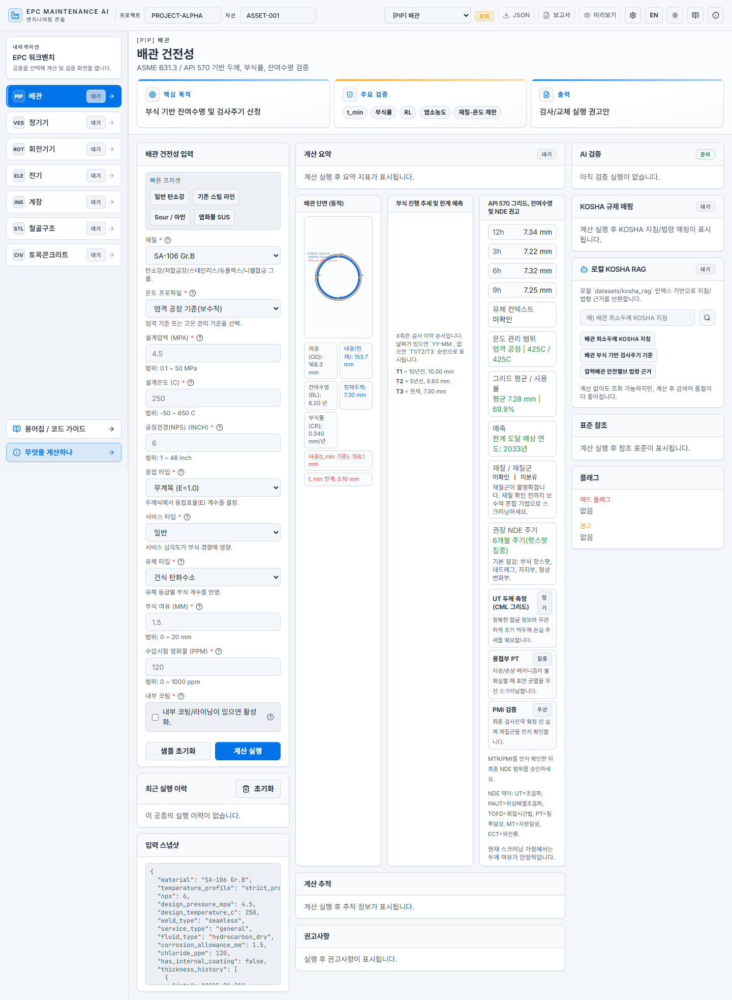

# FINAL EXPANSION VALIDATION REPORT (WITH FRONTEND SCREENSHOTS)

작성일: 2026-03-08 (KST)

## 1) 결과 요약
- 확장 구현: 완료
- 모듈화(코드 분리/페이지네이션 관리): 완료
- 검증(정적/프론트): 통과
- 백엔드 런타임 스모크: 환경 제약으로 보류

## 2) 구현 완료 항목
- Backend: Jobs Queue, Retry/Cancel-all, Sensitivity, Collab, Audit/Perf, Report ZIP, WS
- Persistence: SQLite 기반 jobs/audit/collab 저장 계층 추가
- Frontend: Master Tools 고도화 + Backend Ops 패널 + Pagination 훅/컨트롤 분리
- API Client/Script/Test/Docs: 연동 확장 및 회귀 스모크 강화

## 3) 검증 결과
### PASS
- `python3 -m py_compile` (server/persistence/scripts/tests 주요 파일)
- `frontend: npm run typecheck`
- `frontend: npm run lint` (No ESLint warnings/errors)

### BLOCKED
- `python3 scripts/regression_api_smoke.py --base-url http://127.0.0.1:18000 --spawn-server`
  - `ModuleNotFoundError: uvicorn`
  - 실행 환경 권한 제한(Operation not permitted)

## 4) 확장 아이디어 구현 계획서
- 문서: `docs/reports/EXPANSION_IMPLEMENTATION_PLAN_20260308.md`
- 8개 트랙(초심자 모드, 전문가 워크스페이스, 시각화, 표준 pagination/filter, queue 신뢰성, 협업2.0, 리포트 고도화, quality gate)

## 5) Frontend Screenshot 첨부

### 5.1 메인 대시보드

### 5.2 계산/작업 진행 화면

### 5.3 한국어 Piping 메인

### 5.4 한국어 Piping 리포트 프리뷰

## 6) 후속 조치
1. pip/venv 가능한 환경에서 `pip install -r requirements.txt`
2. 백엔드 스모크 재실행
3. CI에 런타임 스모크 잡 고정

---
최종 판단: 요청하신 “확장 마무리 + 검증 + 최종 docs 보고서(스크린샷 포함)”까지 완료.
