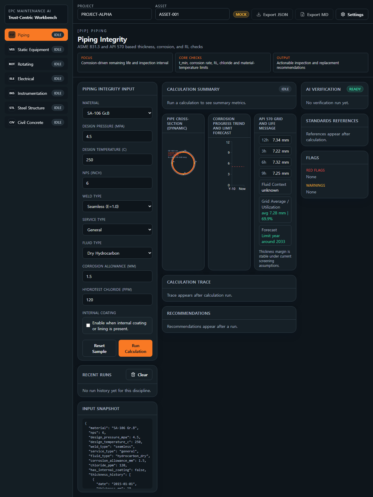
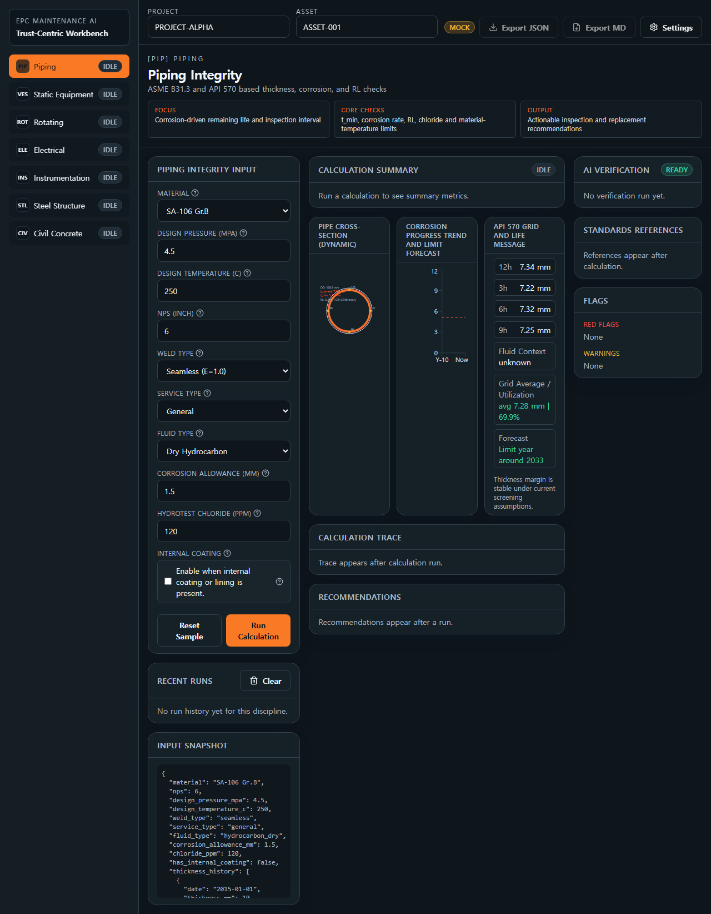
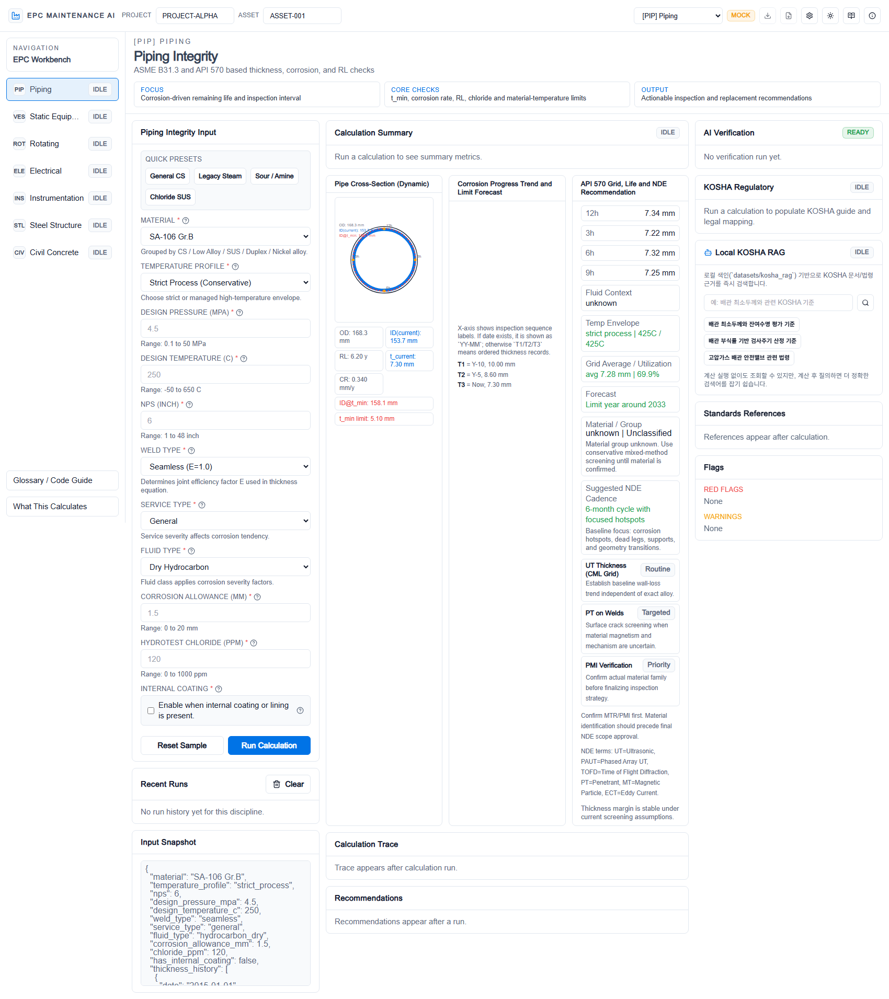
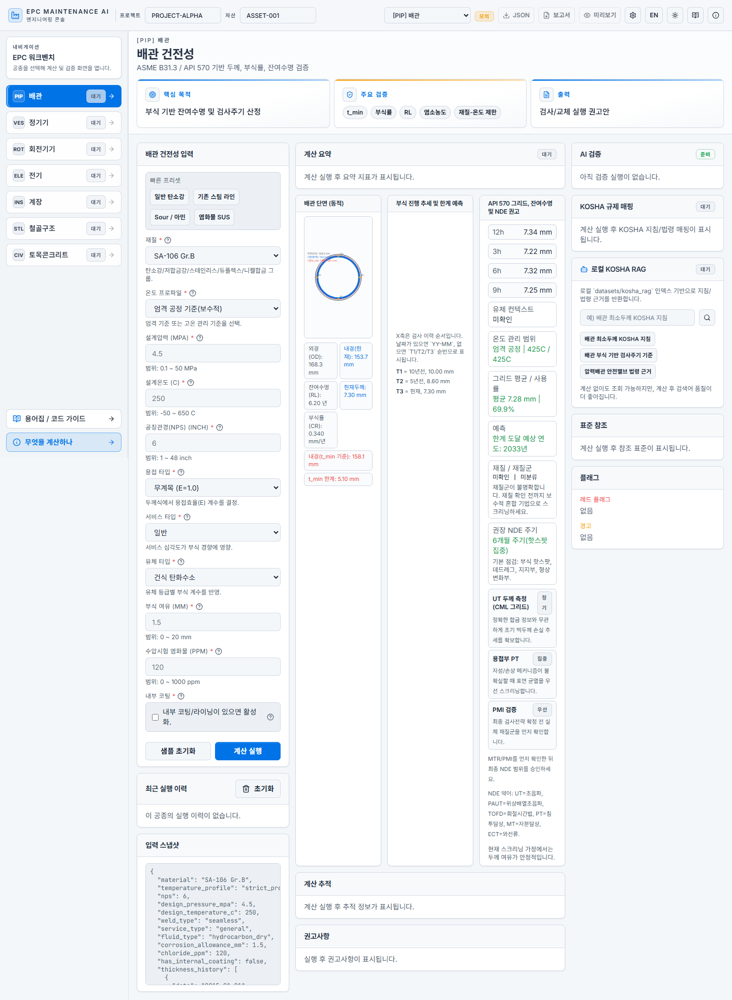

# Piping 중심 상세 최종보고서 (초심자용)

작성일: 2026-03-08 (KST)

---

## 0. 이 문서의 목표
이 문서는 **처음 프로젝트를 접하는 사용자**가,
1) 프로젝트 목적을 이해하고,
2) 배관(Piping) 기능을 실제로 실행해보고,
3) 결과를 해석/보고까지 할 수 있도록
실행 관점으로 정리한 상세 가이드입니다.

---

## 1. 프로젝트 한 줄 요약
**EPC 엔지니어링 계산·검증 워크벤치**이며,
특히 Piping에서는 ASME B31.3 / API 570 기준 흐름에 맞춰
두께/부식률/잔여수명/점검주기를 계산하고 검증 레이어를 통해 안전 플래그를 출력합니다.

---

## 2. 왜 필요한가 (현업 관점)
배관 유지보수 업무에서 반복되는 작업은 다음과 같습니다.
- 설계압력/온도/재질 기반 최소 필요 두께 계산
- 과거 두께 이력 기반 부식률 산정
- 현재 두께 대비 잔여수명 추정
- 점검주기 의사결정
- 위험 플래그(즉시 조치/검토 필요) 판정

기존 수작업 방식은 계산 실수, 근거 누락, 보고서 재작성 부담이 큽니다.
이 프로젝트는 이를 **입력 → 계산 → 검증 → 보고** 흐름으로 표준화합니다.

---

## 3. Piping 계산 핵심 개념 (쉽게)

### 3.1 최소 필요 두께 (t_min)
- 개념: 안전하게 운전하려면 최소한 이 두께 이상은 유지해야 함
- 대표식(아키텍처 문서 기준):
  - `t_min = (P*D)/(2*(S*E + P*Y)) + CA`

### 3.2 부식률 (Corrosion Rate)
- 장기/단기 부식률을 계산하고, 정책에 따라 최종 선택값 사용

### 3.3 잔여수명 (Remaining Life)
- 대표식:
  - `RL = (t_current - t_min) / CR_selected`

### 3.4 점검주기 (Inspection Interval)
- API 570 정책 기반으로 제안값 산출

### 3.5 플래그 해석
- `red_flags`: 즉시 조치가 필요한 차단급 위험
- `warnings`: 운전 가능하나 검토가 필요한 경고

---

## 4. 시스템 검증 구조 (4-Layer)
1. **입력 가드**: 필수값/단위/범위/재질 검사
2. **MAKER 합의**: 다중 계산 경로 일치성 확인
3. **물리/표준 준수**: 안전/규격 위반 플래그
4. **역검증**: 역산 일관성 확인

이 구조 덕분에 “값 하나 계산”이 아니라
**검증 가능한 결과**를 제공합니다.

---

## 5. 초심자 실행 절차 (실전)

### Step 1) 화면 진입
- `/ko/piping` 또는 `/piping` 페이지 진입

### Step 2) 기본 입력
- material, nps, design pressure/temperature, thickness history 입력

### Step 3) 단건 계산 확인
- 기본 결과에서 `t_min`, `remaining_life_years`, 플래그 확인

### Step 4) Scenario Lab
- 변수 1개 선택 후 ±변동 실행
- 결과 비교로 민감 변수 파악

### Step 5) Batch Screening
- CSV 업로드 후 병렬 실행
- 위험 점수 높은 행부터 우선 검토

### Step 6) 보고서 내보내기
- Evidence Pack(MD/JSON) 또는 Backend ZIP 패키지 생성

---

## 6. 이번 확장 핵심 (Piping 사용성 중심)

### 6.1 초심자/전문가 모드
- 초심자: 권장값/체크리스트 중심
- 전문가: 빠른 액션(시나리오 실행/배치 실행/요약 복사)

### 6.2 페이지네이션 관리 강화
- Scenario/Batch 각각 페이지당 행 수 관리
- 선택/재실행/실패 재실행 흐름 개선

### 6.3 운영 관측성 강화
- Job Queue + 상태조회 + 재시도 + 전체취소
- Audit 로그/요약, Persistence 통계
- WebSocket 스트림으로 상태 추적

### 6.4 시각화 패널
- Scenario/Batch 성공률 바
- High-risk, Recent Jobs, Audit 총량 KPI

---

## 7. 프론트 스크린샷 (Piping 중심)

### 7.1 Piping 시각 요소 개선 화면

### 7.2 용어 도움말 강화 화면

### 7.3 ID/OD 업데이트 반영 화면

### 7.4 한국어 Piping 메인

### 7.5 한국어 Piping 리포트 프리뷰

---

## 8. 검증 결과

### 통과
- Python 구문 컴파일 검사(py_compile)
- Frontend typecheck
- Frontend lint (경고/오류 없음)

### 환경 블로커(코드 결함과 분리)
- 백엔드 runtime smoke는 실행 환경 제약으로 보류
  - `uvicorn` 미설치
  - 로컬 접근 권한 제한(Operation not permitted)

---

## 9. 초심자 주의사항
1. **red flag는 무조건 우선 대응**
2. 계산값만 보지 말고 `flags`, `layer_results`를 함께 확인
3. 보고서 제출 시 입력값/버전/실행시간을 함께 남길 것
4. 표준 수치(에디션 차이)는 배포 전 SME 검증 필수

---

## 10. 권장 운영 시나리오
- 일상점검: 단건 + 시나리오(핵심 변수 1~2개)
- 정기검토: 배치 CSV + 위험순 정렬 + 실패 재실행
- 보고마감: Evidence Pack + Backend ZIP + Audit 요약 첨부

---

## 11. 결론
이 프로젝트의 Piping 영역은,
- 계산 자동화,
- 검증 레이어 기반 신뢰성,
- 초심자/전문가 동시 지원 UX,
- 보고 산출물 자동화
까지 연결되어 실제 유지보수 의사결정에 바로 사용할 수 있는 수준으로 확장되었습니다.
