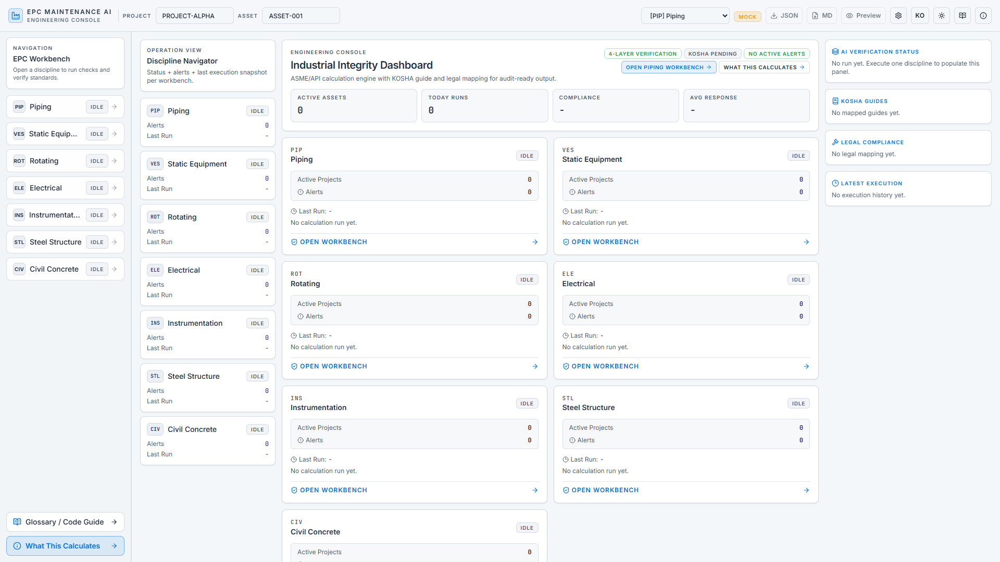
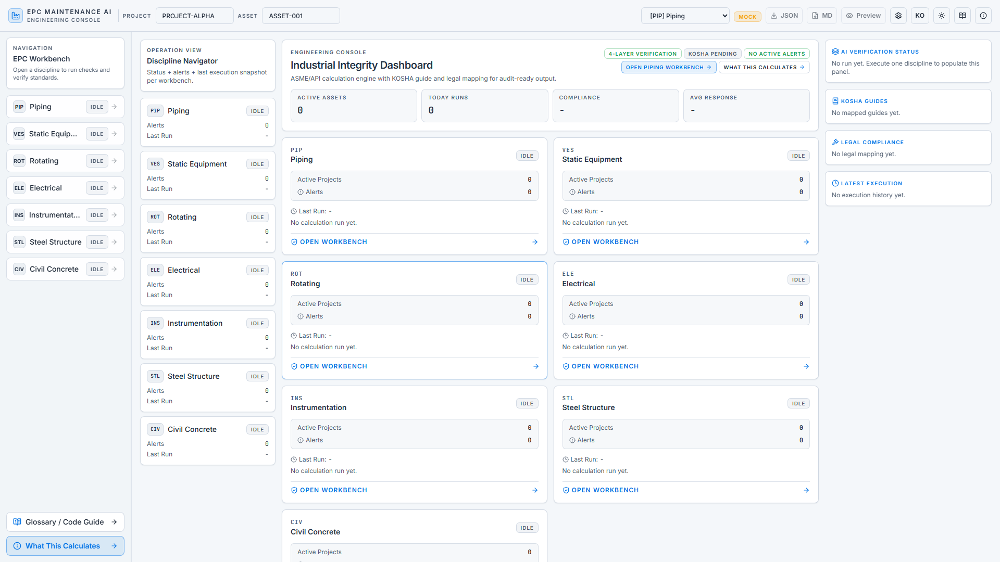
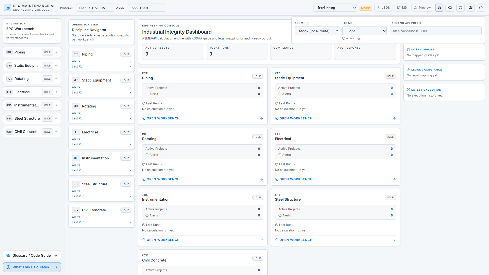
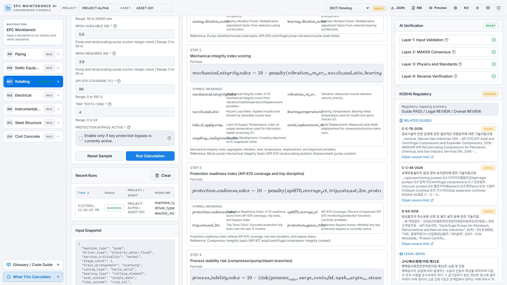
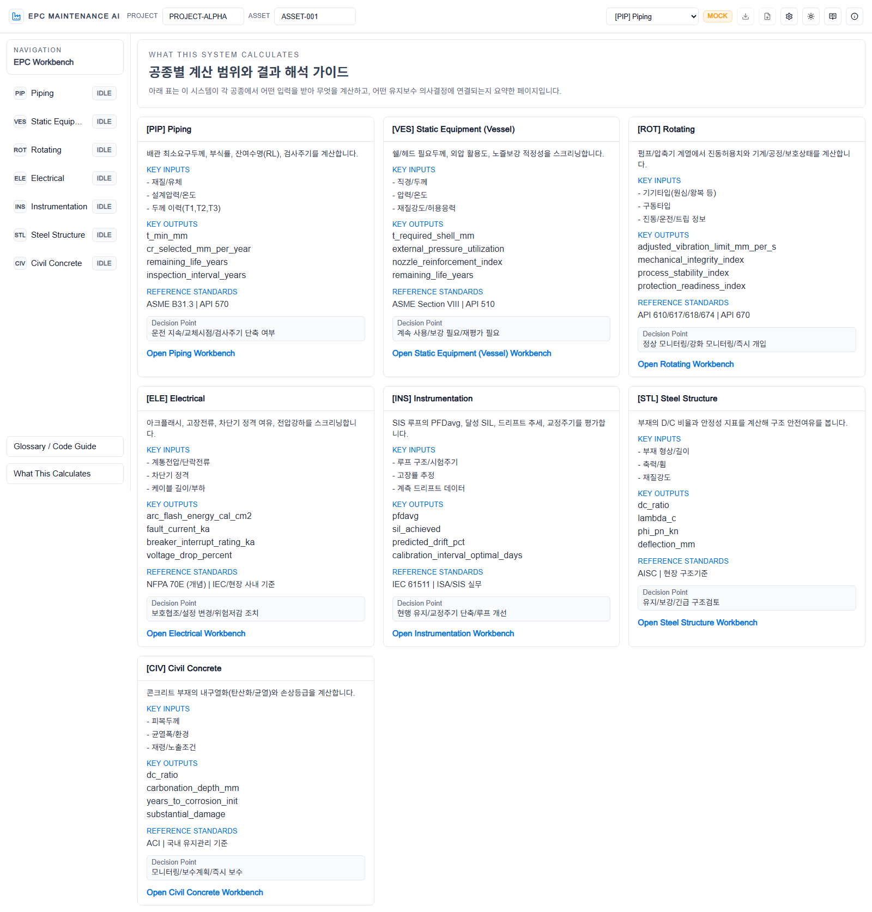
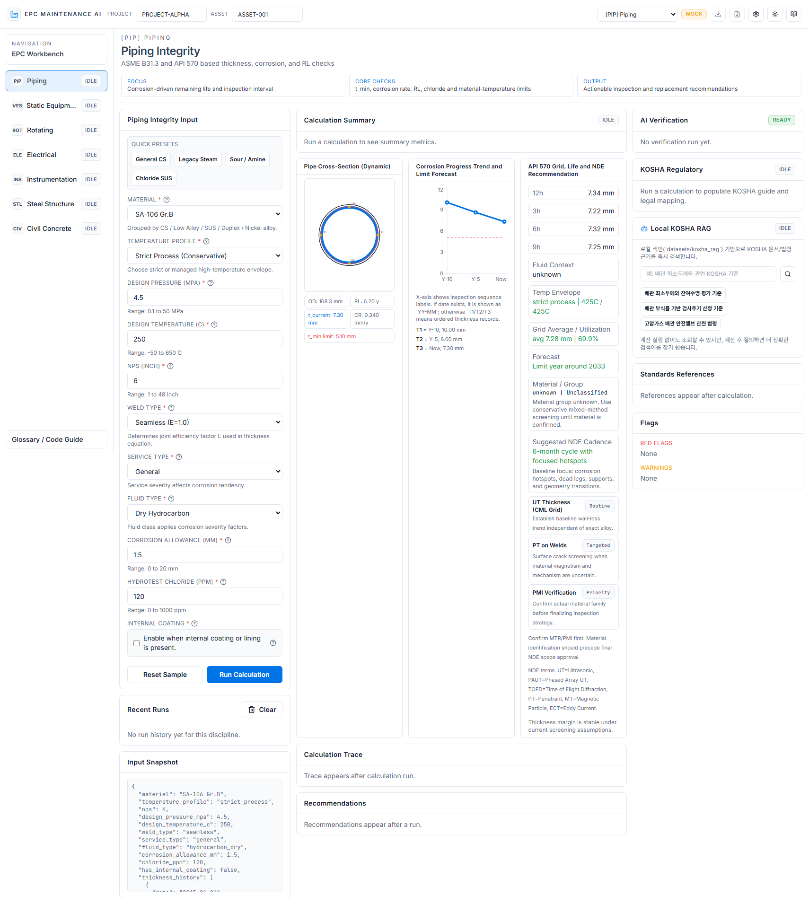
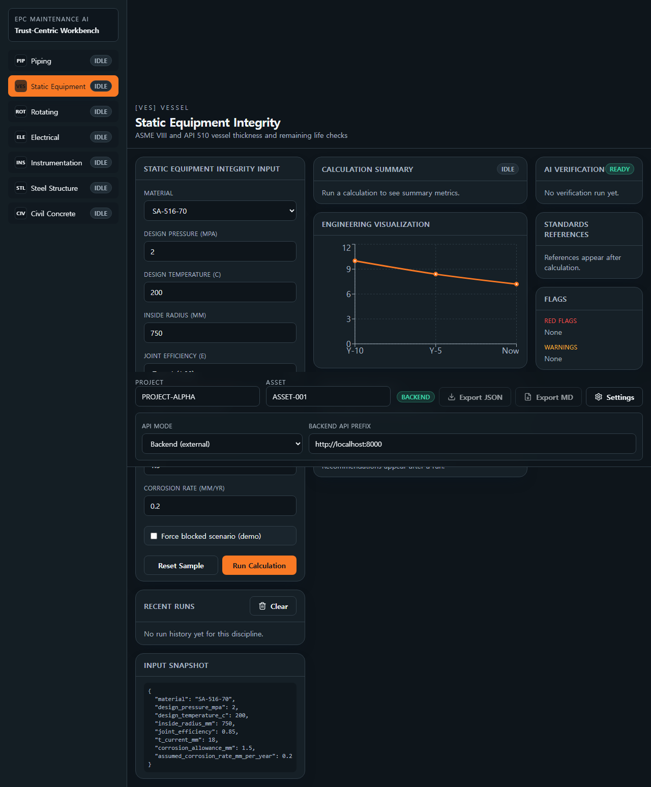

# 전 공종 통합 상세 최종보고서 (초심자용)

작성일: 2026-03-08 (KST)
문서 목적: 처음 보는 사용자도 프로젝트의 목적·구조·사용법·검증 상태를 이해하고, 전 공종(Civil/Steel/Piping/Rotating/Vessel/Electrical/Instrumentation)에 공통 적용 가능한 방식으로 바로 사용할 수 있게 안내.

---

## 1. 프로젝트 목적 (왜 만들었는가)
본 프로젝트는 EPC 유지보수/신뢰성 업무에서 반복되는 계산·검토·보고를 표준화하기 위한 엔지니어링 워크벤치입니다.

핵심 목표는 3가지입니다.
- 초심자는: 빠르게 첫 결과를 만들고, 결과 해석까지 따라올 수 있게
- 실무자는: 다건 배치/재실행/필터링으로 처리량을 높이게
- 조직은: 감사로그/검증근거/리포트 패키지로 추적성과 재현성을 확보하게

---

## 2. 지원 공종과 공통 운영 모델

### 2.1 지원 공종
- Civil
- Steel
- Piping
- Rotating
- Vessel
- Electrical
- Instrumentation

### 2.2 공종 공통 운영 흐름
1) 입력값 준비 (자산/프로젝트/설계/운전 조건)
2) 단건 계산 실행 (기본 안전성/결과 확인)
3) Scenario Lab (민감도 분석)
4) Batch Screening (CSV 대량 실행)
5) 위험순 정렬 및 실패 재실행
6) Evidence Pack/ZIP 리포트 생성
7) Audit 요약으로 기록/제출

---

## 3. 시스템 전체 구조 (사용자 관점)

### 3.1 프론트엔드
- Discipline Workbench: 공종별 입력/결과 화면
- Master Tools: 시나리오/배치/필터/페이지네이션/내보내기
- Backend Ops: Job Queue, 상태조회, 재시도, 전체취소, 감사조회

### 3.2 백엔드 API
- 계산 실행 API
- Job Queue API (create/get/list/cancel/retry/cancel-all)
- Sensitivity API
- Collaboration API (코멘트/승인 이벤트)
- Audit/Perf/Persistence API
- Report Package API (ZIP)
- WebSocket Job Stream API

### 3.3 저장/추적
- SQLite 기반 persistence 계층
- jobs / audit_logs / collab_events 저장
- 검증/리포트 산출물 관리

---

## 4. 이번 확장에서 실제로 개선된 것

### 4.1 기능 확장
- Job Queue 라이프사이클 완성: 생성/상태조회/재시도/전체취소
- 민감도 분석 endpoint 확장
- 감사 요약/성능 통계 API 추가
- 리포트 ZIP 패키징 추가
- 실시간 상태 스트림(WebSocket) 추가

### 4.2 프론트 사용성
- Scenario/Batch 고도화: 검색/필터/정렬/다중선택/실패 재실행
- 페이지네이션 훅/컨트롤 모듈화
- Backend Ops 패널 분리
- 초심자/전문가 모드 + 전문가 빠른 액션 추가
- 운영 개요 시각화 패널(KPI + 성공률 바) 추가

### 4.3 코드 품질/구조
- 대형 컴포넌트 기능 분리(훅/패널/유틸)
- 로컬 상태(localStorage) 재사용 훅 정리
- 린트/타입체크 기준 유지

---

## 5. 초심자 빠른 시작 (전 공종 공통)

### Step A. 첫 실행
- 공종 페이지 진입 후 샘플 입력으로 단건 계산 실행
- 결과에서 `status`, `flags`, `confidence` 먼저 확인

### Step B. 민감도 확인
- Scenario Lab에서 핵심 변수 1개 선택
- ± 변동 결과를 비교해서 민감 변수 파악

### Step C. 대량 검토
- Batch CSV 업로드 후 병렬 실행
- 위험 점수 높은 순으로 우선 검토
- 실패 행은 실패 재실행으로 복구

### Step D. 보고서/근거 저장
- 요약 복사
- Evidence Pack(MD/JSON) 내보내기
- Backend ZIP 패키지 생성

---

## 6. 공종별 적용 포인트 (요약)

### Civil
- 구조물/기초 관련 유지관리 항목의 조건 비교 및 배치 검토에 유리

### Steel
- 재질/두께/부식 이력 기반의 위험 분류 및 점검 우선순위 수립

### Piping
- 두께/부식률/잔여수명/점검주기 계산과 플래그 기반 의사결정

### Rotating
- 장비 상태 결과를 다건 비교하고 경고 항목 중심 유지보수 계획 수립

### Vessel
- 압력용기 관련 조건 입력 후 백엔드 모드로 추적성 있는 검토/보고 수행

### Electrical
- 전기 설비 조건별 결과 편차를 시나리오/배치로 비교 검증

### Instrumentation
- 계장 조건/경보 연관 검토를 배치로 누적 점검, 감사로그로 이력 확보

---

## 7. 검증 결과 (현재 세션 기준)

### 통과
- Python 정적 컴파일 검사(py_compile): PASS
- Frontend Typecheck: PASS
- Frontend Lint: PASS (No ESLint warnings or errors)

### 환경 블로커
- 백엔드 런타임 smoke는 환경 제약으로 보류
  - `uvicorn` 미설치
  - 로컬 소켓/접근 권한 제한(Operation not permitted)

해석: 코드 결함 확정 사안이 아니라 실행 환경 준비 이슈.

---

## 8. 운영 리스크와 대응

### 리스크
- 의존성 환경이 고정되지 않으면 런타임 검증 공백 발생
- 기능 확장에 따라 UI 복잡도가 증가할 수 있음

### 대응
- CI에 런타임 smoke job 분리 고정
- Beginner/Expert 모드로 사용자 난이도 분리
- 공통 pagination/filter 모듈 사용으로 일관성 유지

---

## 9. 전 공종 관점의 최종 권장 운영안
1) 일일 운영: 단건 + 시나리오(핵심 변수)
2) 주간 운영: 배치 대량 검토 + 실패 재실행 + 위험순 리뷰
3) 월간 보고: Audit summary + Evidence Pack + ZIP 패키지 묶음 제출

---

## 10. 프론트 스크린샷 (전 공종 관점)

### 10.1 메인 랜딩

### 10.2 통합 대시보드

### 10.3 설정 패널

### 10.4 모바일/반응형(회전기계 예시)

### 10.5 결과 화면(회전기계 예시)

### 10.6 계산 가이드 화면

### 10.7 프론트 연결 미리보기

### 10.8 Vessel 백엔드 모드 디버그 화면

---

## 11. 결론
이 프로젝트는 특정 공종 하나가 아니라, **전 공종을 공통 운영 모델로 묶어**
- 계산,
- 검증,
- 대량 처리,
- 추적 가능한 보고
를 하나의 워크벤치에서 수행하도록 확장되었습니다.

초심자는 가이드형으로 시작하고,
숙련자는 고속 워크플로우로 확장할 수 있는 구조가 확보되어 있습니다.
